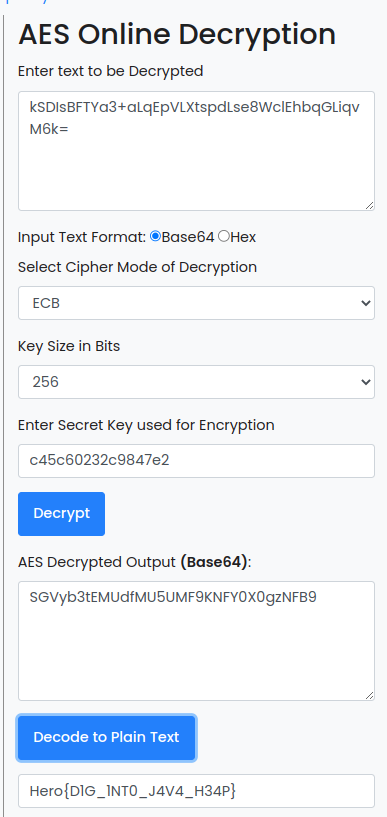

# HEAP

### Category

Forensic

### Description

We caught a hacker red-handed while he was encrypting data. Unfortunately we were too late to see what he was trying to hide. We did however manage to get a dump of the java heap.

Try to find the information he wants to hide from us.

Format : **Hero{}**<br>
Author : **Thib**

### Files


### Write up

At first, we suspect that the hprof file provided was generated by Android Studio. It is not a common format, it must be converted into a standard format to use the tool of our choice. 

We can use HPROF Converter to do this.

```bash
hprof-conv heap.hprof heap-conv.hprof
```

Now, we can use the [Eclipse Memory Analyze Tool](https://www.eclipse.org/mat/)

After we opened the file, the good idea is to look at the Histogram tab. 


The histogram lists the objects grouped by their class present in the dump. We have to find everything about encryption in order to understand what have benn encrypted. But what encryption method have been used ?

Let's find it.

After multiple strings/grep in the file, me can see that there is multiple result about AES. So we can start from there.


A regex search in the histogram gives us a very interesting result. `com.hero.cryptedsecret.AESEncrypt`

Now, we can see the outgoing reference of the object. More information about outgoing reference [here](https://dzone.com/articles/eclipse-mat-incoming-outgoing-references)


Wow! A message, a key and a AES mode. The message is a base64 encoded.

An online tool give us the flag easily.



### Flag

```Hero{D1G_1NT0_J4V4_H34P}```