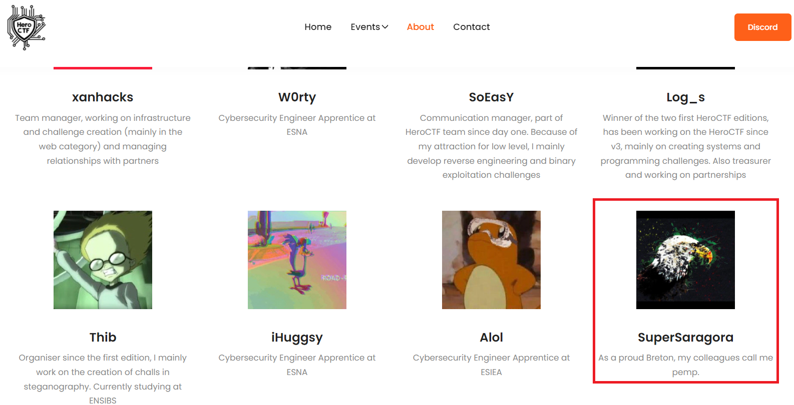
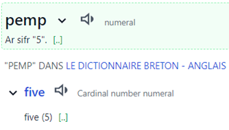

# Hero Agency 1/4 

### Category

OSINT

### Description

*As an special agent of the Hero Agency, you have received an urgent message through a brain implant device. Your mission is to use OSINT techniques to gather information and brilliantly solve the mission. The clock is ticking, so use your skills wisely and act quickly to prevent any harm from coming to innocent lives. Good luck!*

What is the identity of the missing agent?

Format : **Hero{pseudo}**<br>
Author : **cresus**

### Files

- [emergency_broadcast.mp3](emergency_broadcast.mp3)

### Write up

The provided audio recording translates to the following:
> HERO AGENCY EMERGENCY BROADCAST SYSTEM
EMERGENCY LEVEL 5 OF 5
START OF MESSAGE
AGENT V5 IS MISSING 
DO EVERYTHING IN YOUR POWER TO FIND HIM
END OF MESSAGE
END OF BROADCAST

We know that we have to find a missing agent and, thanks to the introduction text and the audio recording, we know the following information:

- **Hero Agency**, from which we can deduce that it is an intelligence agency
- **Agent v5**

With the help of these elements, we can suspect that the Hero Agency is in connection with the HeroCTF and thus that visiting the site would be a judicious idea.

If we go to the website of the HeroCTF, [https://www.heroctf.fr/](https://www.heroctf.fr/), there is a page called “About” with all the people behind. From here, we can focus our attention on SuperSaragora and its biography.



> As a proud Breton, my colleagues call me pemp.

The words “Breton” and “pemp” must intrigue: By searching what is the signification of “pemp” in Breton (which is a language for the French region called Bretagne) we can find that it is the breton’s word for "five".



We now know that the colleagues of “SuperSaragora” call him **five** in Breton and that we are searching for the agent v**5** of the Hero Agency. 

The information matches so **SuperSaragora** is our agent and the first flag is found.

### Flag

```plain
Hero{supersaragora}
```
