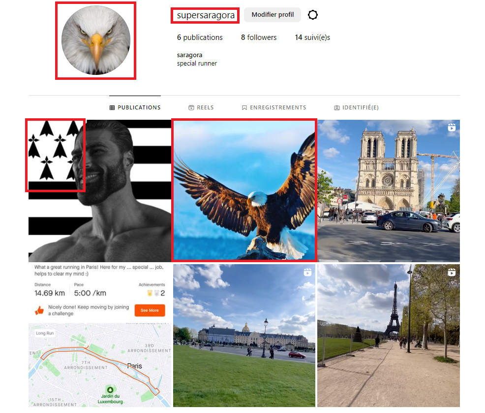
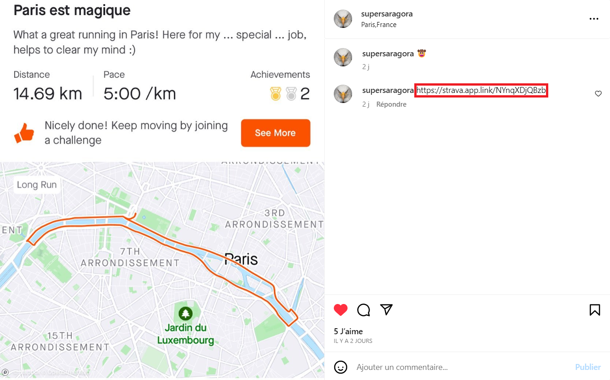
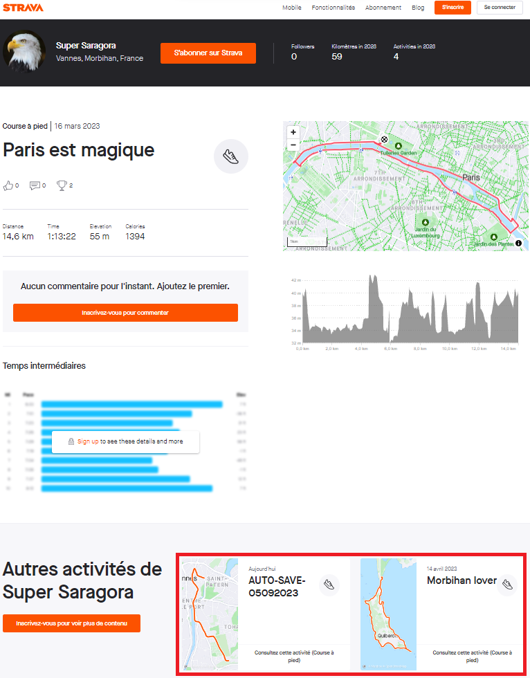
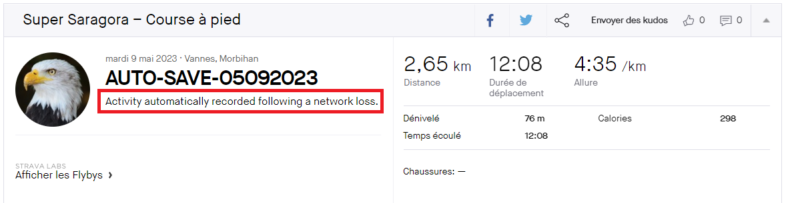
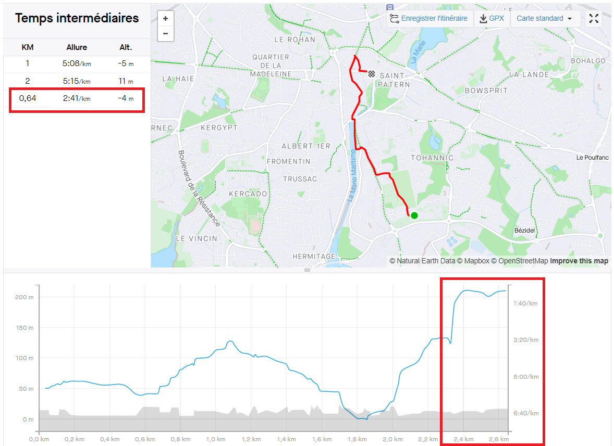
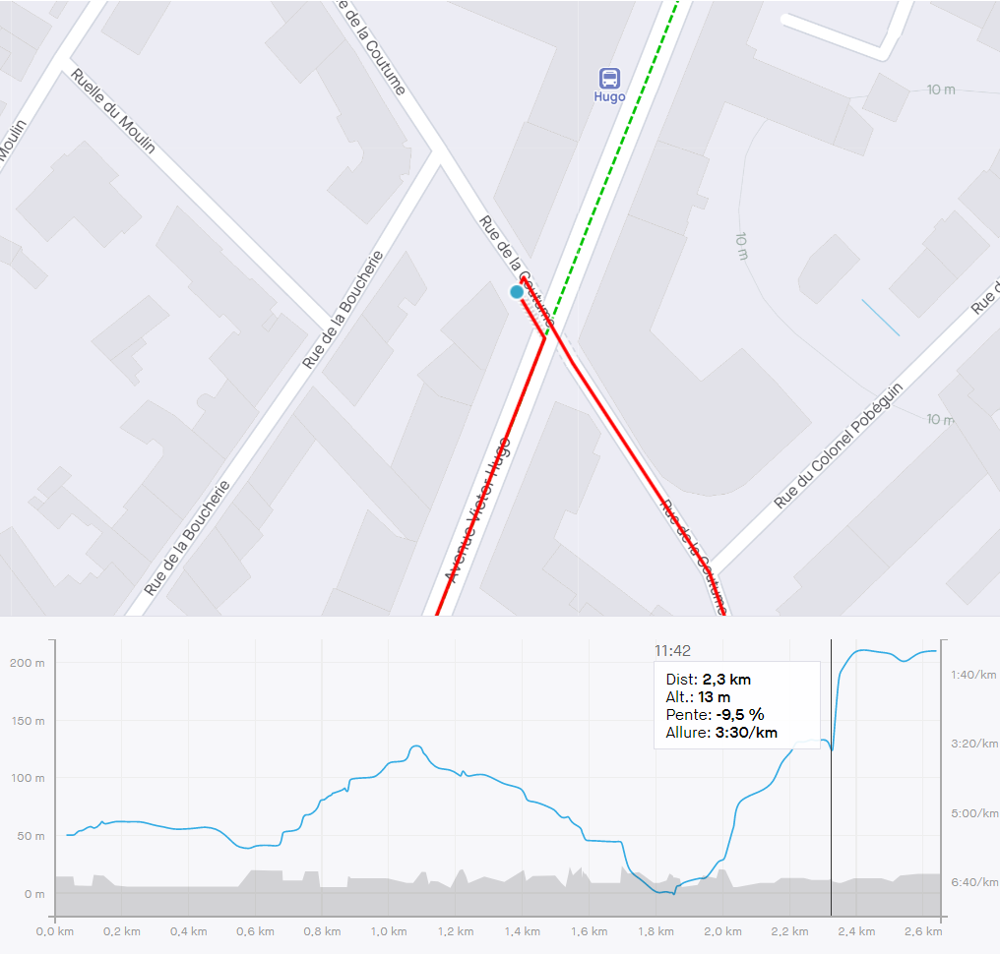

# Hero Agency 2/4

### Category

OSINT

### Description

*As an special agent of the Hero Agency, you have received an urgent message through a brain implant device. Your mission is to use OSINT techniques to gather information and brilliantly solve the mission. The clock is ticking, so use your skills wisely and act quickly to prevent any harm from coming to innocent lives. Good luck!*

On which street the agent was kidnapped?

PS: Accents are to be discarded, spaces are to be replaced with underscores and only the street name should be kept (eg. "Rue de la Générale Rivôli" -> "generale_rivoli"). Casing does not matter.

Format : **Hero{street}**<br>
Author : **cresus**

### Write up

Thanks to the previous question, we know that we have to search a missing agent whose nickname is “SuperSaragora”.

From here, it is judicious to search on internet and especially on social networks. Thus, if we search “**supersaragora**” on **Instagram** we will find an interesting account, whose profile picture is an eagle, as on the HeroCTF website, and that there is the flag of Bretagne on his last publication:



By analyzing the publications of supersaragora, we notice that the person behind the account is a running fan. We must retain our attention on the sharing of one of its foot race. If we look at the comments, the sharing link is displayed:



By going to the URL provided, we see that we can access all its other races:



We see two races. One of them catches our attention because, as its title indicates, it is an automatic save. When we click, we realize that a lot of information is not displayed if we do not have an account, so we have to create one.

After creating an account, we have access to the description:



We see that the race has been saved after a network loss... interesting!

Also, we have access to the race speed:



This shows us that the last moments of the race were very fast: we see 2:41/km on the last 640m on the table and an important evolution of the race on the curve which corresponds to a pace of about 1:10/km (which is more than 50 km/h).

We can conclude that the agent was kidnapped just before his speed reached 50km/h, which is the speed of a car. If we look at which street this corresponds to, it is "**rue de la coutume**":



This is our second flag!

### Flag

```plain
Hero{coutume}
```
