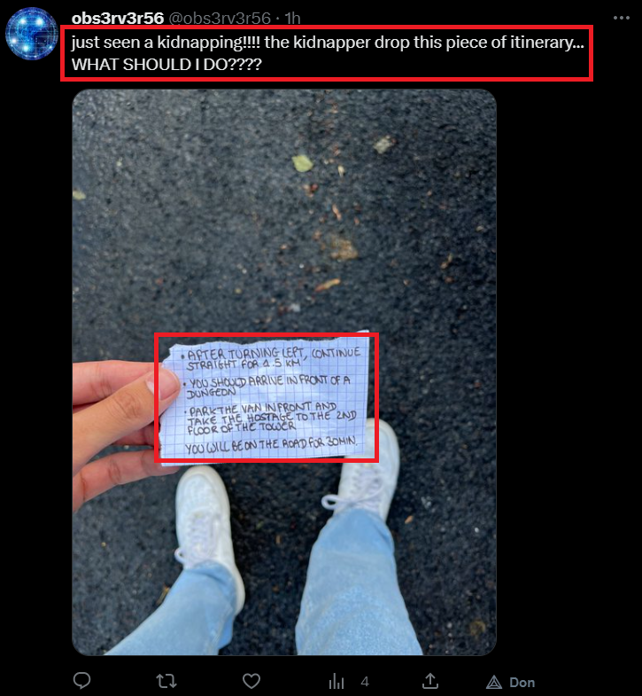

# Hero Agency 3/4

### Category

OSINT

### Description

*As an special agent of the Hero Agency, you have received an urgent message through a brain implant device. Your mission is to use OSINT techniques to gather information and brilliantly solve the mission. The clock is ticking, so use your skills wisely and act quickly to prevent any harm from coming to innocent lives. Good luck!*

What kind of evidence was left behind by the thugs on the kidnapping spot?

Format : **Hero{evidence}**<br>
Author : **cresus**

### Write up

We know that the agent we are looking for was kidnapped on **rue de la coutume in Vannes, at about 18:50 on Tuesday, May 9, 2023**. A good lead is to inquire on the social networks if someone would have attended the scene.

To do this we can use Twitter and his advanced search feature which allows to use dates and GPS coordinates:

```
since:2023-05-09 && geocode:47.66067289583415,-2.757803064539331,1km
```

Thanks to this research, we came across a very interesting publication:



The person says he witnessed a kidnapping, in Vannes, 5 minutes after the Super Saragora race was over: we have our witness and the evidence.

The evidence is a piece of itinerary, on which is written:
> AFTER TURNING LEFT, CONTINUE STRAIGHT FOR 1.5KM
> YOU SHOULD ARRIVE IN FRONT OF A DUNGEON
> PARK THE VAN IN FRONT AND TAKE THE HOSTAGE TO THE 2ND FLOOR OF THE TOWER 
> YOU WILL BE ON THE ROAD FOR 30MIN

The third flag of this challenge is "**itinerary**".

### Flag

```plain
Hero{itinerary}
```
