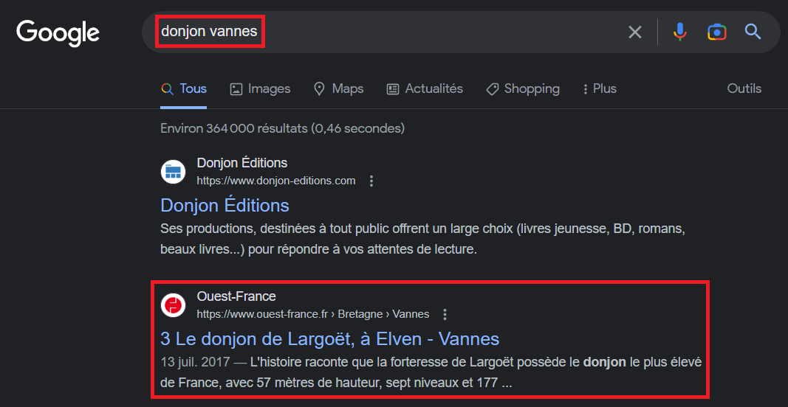
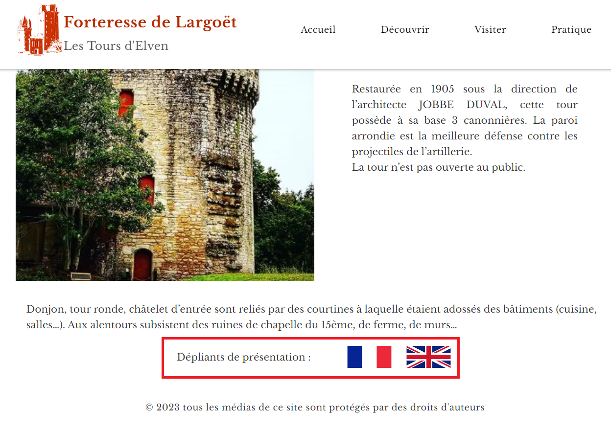
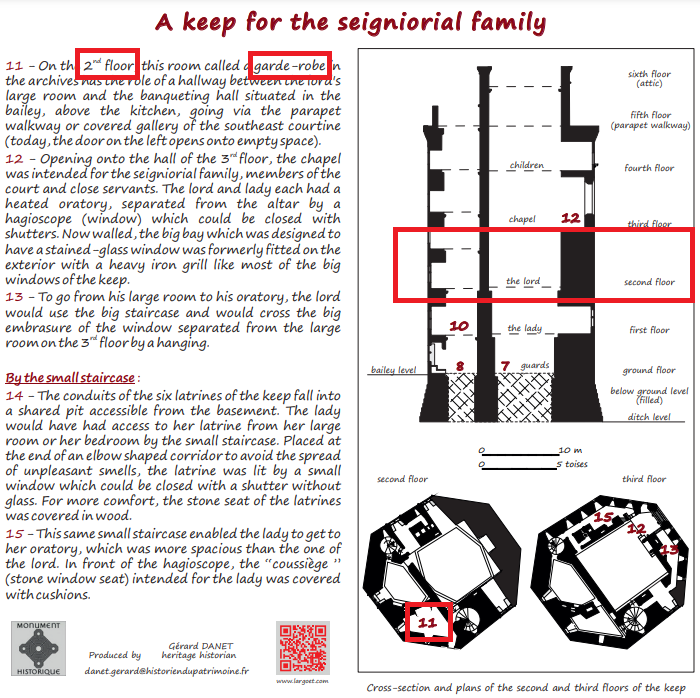

# Hero Agency 4/4

### Category

OSINT

### Description

*As an special agent of the Hero Agency, you have received an urgent message through a brain implant device. Your mission is to use OSINT techniques to gather information and brilliantly solve the mission. The clock is ticking, so use your skills wisely and act quickly to prevent any harm from coming to innocent lives. Good luck!*

Where is the agent relaxed? Be accurate!

Format : **Hero{place}**<br>
Author : **cresus**

### Write up

Thanks to the photo of the itinerary that the observer posted on Twitter, we can see that the agent was taken away:

- **Next to a dungeon**
- **On the second floor of a tower**
- **Less than 30 minutes drive from Vannes**

A simple Google search allows us to find a conclusive result:



The place will not be enough since the message speaks about a tower, it is thus necessary to find which room. To find that, we need to find out more.

By going on the website of the fortress, [https://www.largoet.com/](https://www.largoet.com/), there is a page "Discover" then "Description" on the top navigation bar. Then, at the bottom of this page, we find some presentation leaflets:



Looking at the brochure, a room on the second floor is mentioned:



We have found where the agent is being held, it is the **garde-robe**! We must now notify the agency as soon as possible so that its special forces can respond as soon as possible. It is our last flag, congrats :)

### Flag

```plain
Hero{garde-robe}
```
