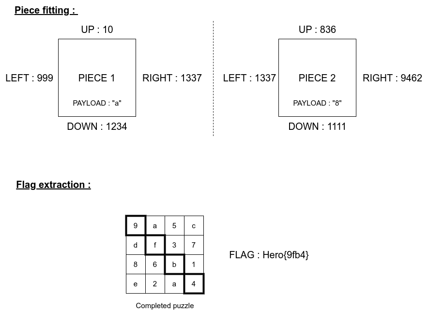
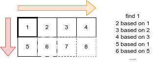

# cub

### Category

Prog

### Description

This is a very simple puzzle. The pieces are in the `puzzle.pickle` file in the following format:

```python
pieces = [(up, right, down, left, payload), (up, right, down, left, payload), ...]
```

`up`, `right`, `down`, `left` are the IDs of the piece edges. You should put together corresponding edges. There are no unused pieces.

They are all integers.

The `payload` field is a python string, composed of a single character contained in the following charset `'0123456789abcdef'`.

The flag is the concatenation of the payloads of the pieces composing the diagonal from the upper-left corner to the lower-right corner.



Format : **Hero{flag}**<br>
Author : **Log_s**

### Files

- [puzzle.pickle](puzzle.pickle)
- [images/recap.png](images/recap.png)

### Write up

This challenge can be solved only by using basic list and loop handleling.

The idea here is to find a corner first. The upper-left corner is the piece that has `up` and `left` identifiers that doesn't have a twin. A simple nested loop will do the trick.

Then, we simply have to iterate over the pieces, and find the piece to it's right (wich's `left` id corresponds to the current piece's `right` id), and so on. When hitting the end of the line, just get the piece bollow. The size of each line can be found by doing the square root of the number of pieces.



Here is a solving script. If the comments aren't enough to understand, feel free to PM me.

```python
import time
import pickle
import math


start_time = time.time()


INPUT_FILE = "puzzle.pickle"
UP = 0
RIGHT = 1
DOWN = 2
LEFT = 3
PAYLOAD = 4


# Parse input
puzzle_pieces = pickle.loads(open(INPUT_FILE, "rb").read())
SIZE = int(math.sqrt(len(puzzle_pieces)))
print(f"[+] Puzzle size: {SIZE}x{SIZE} ({len(puzzle_pieces)} pieces)")


# Find upper left corner
upper_left = None
for piece1 in puzzle_pieces:
    found = True
    for piece2 in puzzle_pieces:
        if piece1[UP] == piece2[DOWN] or piece1[LEFT] == piece2[RIGHT]:
            found = False
            break
    if found:
        upper_left = piece1
        break
puzzle_pieces.remove(upper_left)
print(f"[+] Found upper left corner: {upper_left}")


# Reconstruct puzzle
puzzle = [[None for _ in range(SIZE)] for __ in range(SIZE)]
puzzle[0][0] = upper_left
x, y = 1, 0
while len(puzzle_pieces) > 0:
    if x == 0:
        for piece in puzzle_pieces:
            if piece[UP] == puzzle[y-1][0][DOWN]:
                puzzle[y][x] = piece
                puzzle_pieces.remove(piece)
                break
    else:
        for piece in puzzle_pieces:
            if piece[LEFT] == puzzle[y][x-1][RIGHT]:
                puzzle[y][x] = piece
                puzzle_pieces.remove(piece)
                break
    x += 1
    if x == SIZE:
        x = 0
        y += 1


# Read flag
flag = ""
for i in range(SIZE):
    flag += puzzle[i][i][4]
print(f"[+] Flag : Hero{{{flag}}}")

print(f"\n--- {time.time() - start_time} seconds ---")
```

This solution allows me to solve the puzzle in 1.4 seconds on average on my computer.

There are two easy tricks that could allow me to solve this faster.

The first is to only build the parts of the puzzle that are required. I will explain this more in depth in the writeup of the next challenge : [e-pu](Prog/e-pu/).

The second one is to preompute the pieces, to switch from a 0(n) neighbour accessing time to 0(1). This will be discussed in the final challenge of this series : [zzle](Prog/zzle/).

### Flag

```Hero{d98e58021ab8454de195cc2eeb5ed3865dfec6bae3bebf3e0ec2f8b32621c1aa}```
