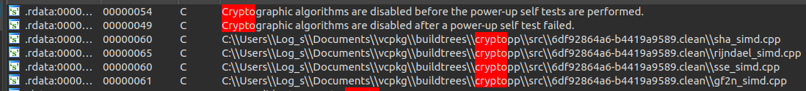
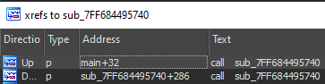

# Hero Ransom

### Category

Reverse

### Description

The mission of analyzing this malware is given to you in order to recover an encrypted file.

**Do not run the malware on yout host machine.**

Format : Hero{flag}<br>
Authors : SoEasY & Log_s

### Files

- [hero_ransom.exe](hero_ransom.exe)
- [flag.txt](flag.txt)

### Write Up

The challenge is a Windows PE32+ (64 bits), visibly a ransomware.

#### Packer

If we open the binary in IDA, we can se a lot of stuff going on in the main. One interesting thing is that at the end of the program, we have an interesting call: `((void (*)(void))(v7 + *(unsigned int *)(*(int *)(v7 + 60) + v7 + 40)))();` which is `call rcx`.

Let's choose the quick win option and debug the main until this call. Let's see what's going on in those instructions:
```x86asm
.text:0x140001BF8     movsxd  rax, dword ptr [r14+3Ch]
.text:0x140001BFC     mov     ecx, [rax+r14+28h]
.text:0x140001C01     add     rcx, r14
.text:0x140001C04     call    rcx
```

We can see that `r14` the address of a PE in memory. Using the [PE format documentation](https://www.aldeid.com/wiki/PE-Portable-executable), we can see that `[r14+3Ch]` contain the `e_lfanew`, the offset to the start of PE header. Then, PE header + 0x28 is derefered which is the `AddressOfEntryPoint` field of the PE header. The the program will call `AddressOfEntryPoint`! This looks like an unpacked PE in memory.

Well, we could dump the PE by hand and fix the IAT by hand etc etc, but that's boring. A lot of tools exist to ease dumping and fixing a PE from memory. For example, [hasherezade](https://twitter.com/hasherezade) made a lot of tools for this purpose. I will use [hollows_hunter](https://github.com/hasherezade/hollows_hunter) that will scan our process memory and automatically dump & fix the PEs in memory.

So when we hit our breakpoint on the `call rcx` we will make hollows_hunter scan our process memory. Using `get_processes()` in the IDA console we can get the PID.

```
117: object
  name: "[64] C:\\Users\\user\\Desktop\\HERO\\hero_ransom.exe"
  pid:        4284.     10BCh       10274o 0000000000000000000000000000000000000000000000000001000010111100b '�.......'
```

Let's scan the process n°4284 with hollow_hunter.

```bash
PS C:\Users\user\Desktop\HERO> .\hollows_hunter64.exe /pid 4284
HollowsHunter v.0.3.5 (x64)
Built on: Nov  6 2022

using: PE-sieve v.0.3.5.0

>> Scanning PID: 4284 : hero_ransom.exe
>> Detected: 4284
--------
SUMMARY:
Scan at: 05/14/23 15:36:43 (1684071403)
Finished scan in: 32 milliseconds
[*] Total scanned: 1
[*] Total suspicious: 1
[+] List of suspicious:
[0]: PID: 4284, Name: hero_ransom.exe
```

We now have our unpacked PE, named by its in-memory address.

```bash
PS C:\Users\user\Desktop\HERO> ls .\hollows_hunter.dumps\process_4284\


    Répertoire : C:\Users\user\Desktop\HERO\hollows_hunter.dumps\process_4284


Mode                 LastWriteTime         Length Name
----                 -------------         ------ ----
-a----        14/05/2023     15:36         516096 1cf23e40000.exe
-a----        14/05/2023     15:36            324 dump_report.json
-a----        14/05/2023     15:36            971 scan_report.json
```

Done! Let's reverse the unpacked PE now.

#### Malware

Let's fire up IDA. We know that the malware encrypted the flag file. The string pannel mentions Cryptography and hashes. A search by string for "crypto" tells us that the used library is Crypto++.



Let's take a look at the main function.

```c
int __cdecl main(int argc, const char **argv, const char **envp)
{
  __int128 v4; // [rsp+20h] [rbp-28h] BYREF
  __int64 v5; // [rsp+30h] [rbp-18h]
  __int64 v6; // [rsp+38h] [rbp-10h]

  v5 = 0i64;
  v6 = 0i64;
  v4 = 0i64;
  sub_7FF68449A950(&v4, ".", 1i64);
  sub_7FF684495740(&v4);
  return 0;
}
```

Two functions are called. The first one takes 3 arguments. A pointer, a string ("."), and the length of the string (1). We can assume that this is the C++ string constructor, and that v4 now holds a string containing ".".

This string is passed to the second function.



This function is called in the main, and within itself. It's a recursive function. Since the string "directory_entry" can be spotted inside the function, and given it's recursive nature, it's safe to assume that this function is responsible of recusively going through the filesystem, with the current directory (".") as starting point.

But when and how the does the encryption occure ?

With the help of the debugger, a function sticks out since it's passed "test.txt" as an argument (the only .txt file I put in the same directory as the malware).

If we reverse this function, we should be able to decrypt the flag.

```c
v19 = unknown_libname_39(0i64);
*(_WORD *)v18 = v16->m128i_i16[0] ^ v19;
v18[2] = v16->m128i_i8[2] ^ BYTE2(v19);
v18[3] = v16->m128i_i8[3] ^ HIBYTE(v19);
*((_WORD *)v18 + 2) = v16->m128i_i16[2] ^ v19;
v18[6] = v16->m128i_i8[6] ^ BYTE2(v19);
v18[7] = v16->m128i_i8[7] ^ HIBYTE(v19);
*((_WORD *)v18 + 4) = v16->m128i_i16[4] ^ v19;
v18[10] = v16->m128i_i8[10] ^ BYTE2(v19);
v18[11] = v16->m128i_i8[11] ^ HIBYTE(v19);
*((_WORD *)v18 + 6) = v16->m128i_i16[6] ^ v19;
v18[14] = v16->m128i_i8[14] ^ BYTE2(v19);
v18[15] = v16->m128i_i8[15] ^ HIBYTE(v19);
*((_WORD *)v18 + 8) = v16[1].m128i_i16[0] ^ v19;
v18[18] = v16[1].m128i_i8[2] ^ BYTE2(v19);
v18[19] = v16[1].m128i_i8[3] ^ HIBYTE(v19);
*((_WORD *)v18 + 10) = v16[1].m128i_i16[2] ^ v19;
v18[22] = v16[1].m128i_i8[6] ^ BYTE2(v19);
v18[23] = v16[1].m128i_i8[7] ^ HIBYTE(v19);
*((_WORD *)v18 + 12) = v16[1].m128i_i16[4] ^ v19;
v18[26] = v16[1].m128i_i8[10] ^ BYTE2(v19);
v18[27] = v16[1].m128i_i8[11] ^ HIBYTE(v19);
*((_WORD *)v18 + 14) = v16[1].m128i_i16[6] ^ v19;
v18[30] = v16[1].m128i_i8[14] ^ BYTE2(v19);
v18[31] = v16[1].m128i_i8[15] ^ HIBYTE(v19);
```

This section xors two elements together, the result being 32 bytes long. The second element being xored (`v19`), is initialized by `unknown_libname_39`. Opening this lib easily shows that the function returns a timestamp.

```c
// Microsoft VisualC 64bit universal runtime
__int64 __fastcall unknown_libname_39(__int64 *a1)
{
  __int64 v2; // rdx
  struct _FILETIME SystemTimeAsFileTime; // [rsp+30h] [rbp+8h] BYREF

  SystemTimeAsFileTime = 0i64;
  GetSystemTimeAsFileTime(&SystemTimeAsFileTime);
  if ( *(_QWORD *)&SystemTimeAsFileTime - 116444736000000000i64 >= 325368000000000000i64 )
    v2 = -1i64;
  else
    v2 = (*(_QWORD *)&SystemTimeAsFileTime - 116444736000000000i64) / 10000000;
  if ( a1 )
    *a1 = v2;
  return v2;
}
```

But what is the timestamp xored with ?

Let's analyse the beginning of the function a little further until the creation of `v17`.

```c
v69[0] = (__int64)&CryptoPP::SHA512::`vftable';
sub_7FF60BD428C0(v69, v13, v12, v61);
```

Here we access the vftable of the SHA512 class. After taking a look at at the Crypto++ documentation, we deduce the called function corresponds to the CalculateDigest function: [https://www.cryptopp.com/docs/ref800/class_hash_transformation.html#af8124c4fca23b74bbdc43660bdae692c](https://www.cryptopp.com/docs/ref800/class_hash_transformation.html#af8124c4fca23b74bbdc43660bdae692c)

The first passed parameter is a pointer to the vftable, so the second one is the first one according to the documentation, thus making it the hash: `v13`.

```c
if ( v16 )
{
  *v16 = *v13;
  v16[1] = v13[1];
  v16[2] = v13[2];
  v16[3] = v13[3];
}
```

This block copies v13 to v16. Here we go! The timestamp is xored with the hash of the filename.

The blocks are repeating themselves, let's analyse one of them.

```c
*(_WORD *)v18 = filename_hash->m128i_i16[0] ^ timestamp;
v18[2] = filename_hash->m128i_i8[2] ^ BYTE2(timestamp);
v18[3] = filename_hash->m128i_i8[3] ^ HIBYTE(timestamp);
```

- First line is casting as a WORD, which is 2 bytes long. It's xoring the 2 first bytes from the hash with the twi first bytes from the timestamp.
- Second line and third line are xoring 1 byte of the hash with respectively the 3rd and 4th byte of the timestamp.

This goes on for the 32 first bytes of the hash.

Right after, the hash is involved in another xor.

```c
v21 = filename_hash + 2;
if ( v20 > (__m128i *)((char *)&filename_hash[3].m128i_u64[1] + 7)
  || (const __m128i *)((char *)&v20->m128i_u64[1] + 7) < v21 )
{
  *v20 = _mm_xor_si128(_mm_loadu_si128(filename_hash + 3), _mm_loadu_si128(v21));
}
```

Since the filename_hash is of type `m128i` (128bit integer) the `filename_hash + 2` and `filename_hash + 3` mean that your accessing respectively the 32nd and 48th byte of the hash.

It transposed to:

```
v20 = XOR(filename_hash[32:48], filename_hash[48:64])
```

But what now ? Where are those two values used ?

```c
v93 = &CryptoPP::CipherModeFinalTemplate_CipherHolder<CryptoPP::BlockCipherFinal<0,CryptoPP::Rijndael::Enc>,CryptoPP::CBC_Encryption>::`vftable';
sub_7FF60BD4FF50(&v93);
sub_7FF60BD4E130((unsigned int)&v93, (_DWORD)v18, 32, (_DWORD)v20, 16i64);
```

`v93` is an Crypto++ AES CBC instance. `sub_7FF60BD4E130` is obviously the encryption function. The parameters are:
- pointer to vftable
- key (`v18`)
- key size (32)
- iv (`v20`)
- iv size (16)

To decrypt the flag we have to repruduce the encryption steps.
1. Hash the filename
2. Get the timestamp
3. Do the 2 xor operations
4. Decrypt the flag

The only problem is that we don't know when the flag was encrypted. We have to bruteforce it. However we can have the compilation date, and we know when the CTF started. We can bruteforce the timestamp between those two dates.

```
$ exiftool hero_ransom_unpacked.exe                                                                           130 ↵
ExifTool Version Number         : 12.40
File Name                       : hero_ransom_unpacked.exe
Directory                       : .
File Size                       : 504 KiB
File Modification Date/Time     : 2023:05:10 01:03:44+02:00
File Access Date/Time           : 2023:05:12 17:09:12+02:00
File Inode Change Date/Time     : 2023:05:10 01:03:44+02:00
File Permissions                : -rw-r--r--
File Type                       : Win64 EXE
File Type Extension             : exe
MIME Type                       : application/octet-stream
Machine Type                    : AMD AMD64
Time Stamp                      : 2023:05:07 21:41:25+02:00
Image File Characteristics      : Executable, Large address aware
PE Type                         : PE32+
Linker Version                  : 14.34
Code Size                       : 353280
Initialized Data Size           : 172544
Uninitialized Data Size         : 0
Entry Point                     : 0x28238
OS Version                      : 6.0
Image Version                   : 0.0
Subsystem Version               : 6.0
Subsystem                       : Windows command line
```

Here is the solution script:

```python
from hashlib import sha512
from Crypto.Cipher import AES
from time import time

FILENAME = "flag.txt"

# Read the encrypted file
encrytped = open(FILENAME, "rb").read()

# Get the hash of the filename that is used as seed
filehash = sha512(FILENAME.encode())
print(f"[*] filehash: {filehash.hexdigest()}")
seed = filehash.digest()

# Compute the iv
iv = b""
for i in range(16):
    iv += bytes([seed[i+32] ^ seed[i+48]])

print(f"[*] Brute forceing the key...")

# From malware compilation time to CTF start time
for t in range(1683486104, 1683918000):
    # Compute possible key
    key = b""
    for i in range(32):
        bt = t >> (i % 4 * 8) & 0xff
        key += bytes([seed[i] ^ bt])

    # Decrypt with AES-CBC
    decrypted = AES.new(key, AES.MODE_CBC, iv).decrypt(encrytped)

    # Try to decode the flag
    try:
        flag = decrypted.decode()
        if "Hero" in flag:
            print(f"[*] iv: {iv.hex()}")
            print(f"[*] key: {key.hex()}")
            print(f"[+] flag: {decrypted.decode().strip()}")
            break
    except:
        pass

```

### Flag

```
Hero{N0t_s0_f4r_fr0m_4_g0od_crypt0_1mpl3ment4t10n...}
```
