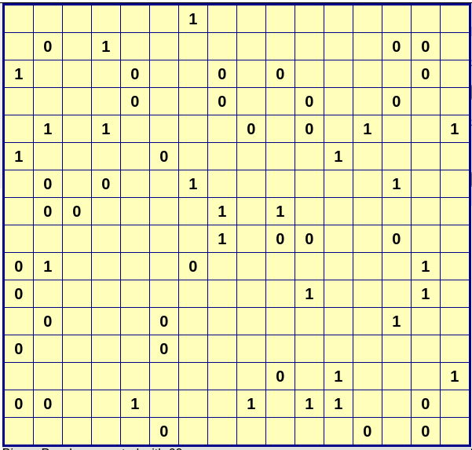

# Optimus Prime

### Category

Reverse

### Description

You must protect the planet. If the Decepticons find the password before us, then our people are truly finished.

Format : Hero{password}<br>
Author : SoEasY

### Files

- [optimus_prime](optimus_prime)

### Write Up

First of all, let's check the binary we've got.
```bash
$ file optimus_prime
optimus_prime: ELF 64-bit LSB pie executable, x86-64, version 1 (SYSV), dynamically linked, interpreter /lib64/ld-linux-x86-64.so.2, BuildID[sha1]=32b8f8bb119f4490a1c40ed74d8b3bb71d388e14, for GNU/Linux 3.2.0, not stripped

$ ./optimus_prime
Autobots, transform and roll out! Bumblebee, give me the password: password
Autobots, fall back! Get to the tower!
```

To be fast, this challenge was pretty straightforward (especially because the functions symbols were provided). It's a [Takuzu](https://en.wikipedia.org/wiki/Takuzu) game with a given grid of 16x16 bytes (see `init_grid()`). The Takuzu is a sort of binary Sudoku with xx constraints that need to be met:
- equal number of 1s and 0s in each row and column
- no more than two of either number adjacent to each other
- there can be no identical rows or columns

Dumping the grid after init, we've got this.



We can use a site like https://binarypuzzle.nl/ to get the solution:


The last this to understand is how our input will be parsed to the grid. Let's take a look at the function called `parse_buffer_to_grid()`:
```c
void __fastcall parse_buffer_to_grid(unsigned __int8 *INPUT)
{
  _BYTE *_GRID; // rax
  int i; // edx

  _GRID = &GRID;

  for ( i = 15; i != 271; i += 16 )
  {
    if ( *_GRID == 0xFF )
      *_GRID = (int)INPUT[(i - 15) >> 3] >> 7;
    if ( _GRID[1] == 0xFF )
      _GRID[1] = ((int)INPUT[(i - 14) >> 3] >> 6) & 1;
    if ( _GRID[2] == 0xFF )
      _GRID[2] = ((int)INPUT[(i - 13) >> 3] >> 5) & 1;
    if ( _GRID[3] == 0xFF )
      _GRID[3] = ((int)INPUT[(i - 12) >> 3] >> 4) & 1;
    if ( _GRID[4] == 0xFF )
      _GRID[4] = ((int)INPUT[(i - 11) >> 3] >> 3) & 1;
    if ( _GRID[5] == 0xFF )
      _GRID[5] = ((int)INPUT[(i - 10) >> 3] >> 2) & 1;
    if ( _GRID[6] == 0xFF )
      _GRID[6] = ((int)INPUT[(i - 9) >> 3] >> 1) & 1;
    if ( _GRID[7] == 0xFF )
      _GRID[7] = INPUT[(i - 8) >> 3] & 1;
    if ( _GRID[8] == 0xFF )
      _GRID[8] = (int)INPUT[(i - 7) >> 3] >> 7;
    if ( _GRID[9] == 0xFF )
      _GRID[9] = ((int)INPUT[(i - 6) >> 3] >> 6) & 1;
    if ( _GRID[10] == 0xFF )
      _GRID[10] = ((int)INPUT[(i - 5) >> 3] >> 5) & 1;
    if ( _GRID[11] == 0xFF )
      _GRID[11] = ((int)INPUT[(i - 4) >> 3] >> 4) & 1;
    if ( _GRID[12] == 0xFF )
      _GRID[12] = ((int)INPUT[(i - 3) >> 3] >> 3) & 1;
    if ( _GRID[13] == 0xFF )
      _GRID[13] = ((int)INPUT[(i - 2) >> 3] >> 2) & 1;
    if ( _GRID[14] == 0xFF )
      _GRID[14] = ((int)INPUT[(i - 1) >> 3] >> 1) & 1;
    if ( _GRID[15] == 0xFF )
      _GRID[15] = INPUT[i >> 3] & 1;
    _GRID += 16;
  }
}
```

This will parse our input as binary, filling in every bit as a byte in the GRID (with the value 0 or 1). For example, if we enter the byte "0xFF", our 8 first cells of the grid will be filled with the value 1. The flag will then be Hero{md5sum(INPUT)}. Let's script this:

```py
from pwn import *

r = process("./optimus_prime")

solution = [
    0b01100110, 0b01001011,
    0b10011011, 0b01001001,
    0b11010100, 0b10110100,
    0b00100110, 0b11001011,
    0b11011001, 0b01001001,
    0b11011001, 0b00110100,
    0b00100110, 0b10110110,
    0b10010011, 0b01001011,
    0b11001001, 0b10011001,
    0b01100100, 0b10110110,
    0b00110110, 0b01101010,
    0b10011001, 0b10010101,
    0b01101010, 0b01100110,
    0b10010100, 0b10011011,
    0b00101101, 0b10110100,
    0b01101011, 0b01100100
]

solution_string = b''

for byte in solution:
    solution_string += byte.to_bytes(1, 'big')

log.warn(f"Testing solution: {solution_string}")

r.sendline(solution_string)
print(r.recvall().decode(), end="")
```

```bash
$ python3 solve.py       
[+] Starting local process './optimus_prime': pid 38589
[!] Testing solution: b'fK\x9bI\xd4\xb4&\xcb\xd9I\xd94&\xb6\x93K\xc9\x99d\xb66j\x99\x95jf\x94\x9b-\xb4kd'
[+] Receiving all data: Done (140B)
[*] Process './optimus_prime' stopped with exit code 0 (pid 38589)
Autobots, transform and roll out! Bumblebee, give me the password: Stay safe, soldier. I am coming. Hero{10726a4ef2ad8bef8e022002c695dc27}.
```

### Flag

```
Hero{10726a4ef2ad8bef8e022002c695dc27}
```
