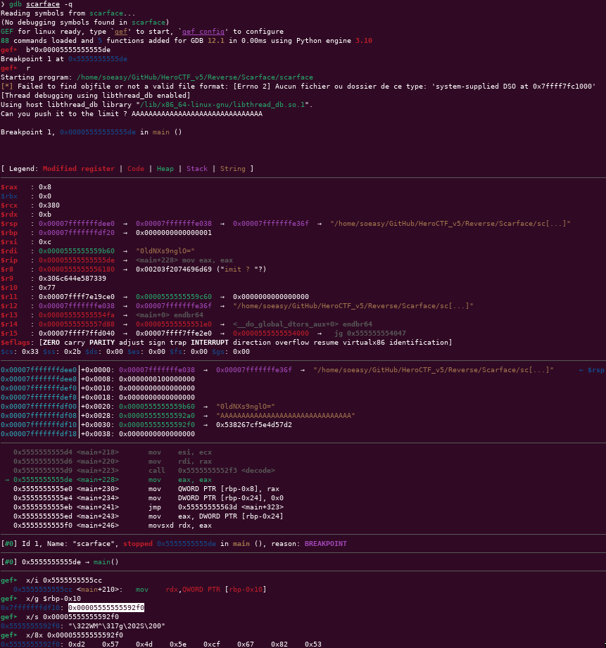

# Scarface

### Category

Reverse

### Description

Maybe you can find my password... But you can't push it to the limit like me.

Format : Hero{password}<br>
Author : SoEasY

### Files

- [scarface](scarface)

### Write Up

First of all, let's see what we've got here:
```bash
$ file scarface         
scarface: ELF 64-bit LSB pie executable, x86-64, version 1 (SYSV), dynamically linked, interpreter /lib64/ld-linux-x86-64.so.2, BuildID[sha1]=759671f9d51903529b22a5dfb1d0ef4eccb22499, for GNU/Linux 3.2.0, not stripped
```

Let's open it in IDA and check the main function:
```c
int __cdecl main(int argc, const char **argv, const char **envp)
{
  unsigned int v3; // ecx
  int j; // [rsp+1Ch] [rbp-24h]
  char *i; // [rsp+20h] [rbp-20h]
  char *v7; // [rsp+20h] [rbp-20h]
  char *s; // [rsp+28h] [rbp-18h]
  _BYTE *v9; // [rsp+30h] [rbp-10h]
  unsigned __int64 v10; // [rsp+38h] [rbp-8h]

  s = (char *)malloc(0x40uLL);
  v9 = malloc(0x40uLL);
  printf("Can you push it to the limit ? ");
  fgets(s, 63, _bss_start);
  s[strcspn(s, "\n")] = 0;
  if ( strlen(s) != 31 )
    fail(s);
  for ( i = check_this_out; *i != 61; ++i )
    ;
  v7 = (char *)UNO_REVERSE_CARD(i);
  v3 = strlen(v7);
  v10 = (unsigned int)decode(v7, v3, v9);
  for ( j = 0; j <= 30; ++j )
  {
    if ( (v9[j % v10] ^ (unsigned __int8)s[j]) != *((_BYTE *)STRANGE + j) )
      fail(v7);
  }
  printf("Well done! You can validate with the flag Hero{%s}\n", s);
  printf("(And watch a last time this : %s)", check_this_out);
  return 0;
}
```

After renaming, retyping and commenting everything, we can get this result:

```c
int __cdecl main(int argc, const char **argv, const char **envp)
{
  unsigned int enc_key_reversed_len; // ecx
  int i; // [rsp+1Ch] [rbp-24h]
  char *enc_key; // [rsp+20h] [rbp-20h]
  char *enc_key_reversed; // [rsp+20h] [rbp-20h]
  _BYTE *INPUT; // [rsp+28h] [rbp-18h]
  _BYTE *dec_key; // [rsp+30h] [rbp-10h]
  unsigned __int64 dec_key_len; // [rsp+38h] [rbp-8h]

  INPUT = malloc(0x40uLL);
  dec_key = malloc(0x40uLL);

  printf("Can you push it to the limit ? ");
  fgets(INPUT, 63, _bss_start);
  INPUT[strcspn(INPUT, "\n")] = 0;

  if ( strlen(INPUT) != 31 )
    fail(INPUT);

  // enc_key = "=Olgn9sXNdl0"
  for ( enc_key = check_this_out; *enc_key != 61; ++enc_key )
    ;

  // enc_key_reversed = reverse("=Olgn9sXNdl0")
  //                  = "0ldNXs9nglO="
  enc_key_reversed = (char *) reverse_string(enc_key);
  enc_key_reversed_len = strlen(enc_key_reversed);

  // dec_key = base64dec("0ldNXs9nglO=")
  //         = "\xd2\x57\x4d\x5e\xcf\x67\x82\x53"
  dec_key_len = base64_decrypt(enc_key_reversed, enc_key_reversed_len, dec_key);

  for ( i = 0; i <= 30; ++i )
  {
    if ( (dec_key[i % dec_key_len] ^ INPUT[i]) != STRANGE[i] )
      fail(enc_key_reversed);
  }

  printf("Well done! You can validate with the flag Hero{%s}\n", INPUT);
  printf("(And watch a last time this : %s)", check_this_out);
  return 0;
}
```

You can see here that I guessed the `reverse_string` and `base64_decrypt` functions. You can reverse engineering it or simply put a breakpoint after the decoding function renamed `base64_decrypt` and dump it from memory.

As we can see in the code that our password must be 31 characters long, we just need to input 'A'*31 and single step to the `base64_decrypt`. This function return the length of the decoded key : 8 bytes.

We can then dump the key from memory.



We can then just do a XOR between our dumped key and the `STRANGE` buffer with a simple script to get the flag.

```py
KEY = b"\xd2\x57\x4d\x5e\xcf\x67\x82\x53"
STRANGE = b"\x81\x63\x34\x01\x87\x54\xee\x1f\xe2\x08\x39\x6e\x90\x0a\xdb\x0c\xbe\x66\x39\x2a\xa3\x54\xdd\x15\x80\x66\x7e\x10\x8b\x46\xa3"
FLAG = ""

for i in range(len(STRANGE)):
	FLAG += chr( STRANGE[i] ^ KEY[i % len(KEY)] )

print("[+] Flag: Hero{" + FLAG + "}")
```
```bash
$ python3 solve.py          
[+] Flag: Hero{S4y_H3lL0_t0_mY_l1ttl3_FR13ND!!}
```


### Flag

```
Hero{S4y_H3lL0_t0_mY_l1ttl3_FR13ND!!}
```
