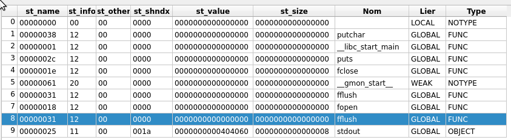

# sELF control v3

### Category

Reverse

### Description

There are multiple problems in this ELF file... Patch it before execution to get the flag!


Format : **Hero{flag}**<br>
Author : **SoEasY**

### Files

 - [get_flag](get_flag)

### Write up

First of all, we can start by checking the `get_flag` file with the `file` command.
```bash
$ file get_flag
get_flag: ELF 64-bit LSB shared object, x86-64, version 1 (SYSV), dynamically linked, interpreter /lib64/ld-linux-x86-64.so.2, BuildID[sha1]=515c4a2fdab640d03bcb845713be1b508ac84be0, for GNU/Linux 3.2.0, stripped
```

We can see that our `get_flag` binary is marked as a shared object (ET_DYN) instead of an executable file (ET_EXEC), which means that it must be a PIE (Position Independant Executable) binary. Let's open it in IDA and check the main.

```c
__int64 __fastcall main(int a1, char **a2, char **a3)
{
  char v4; // [rsp+7h] [rbp-9h]
  FILE *stream; // [rsp+8h] [rbp-8h]

  stream = fopen("flag.txt", "r");
  if ( stream )
  {
    if ( qword_404058 == 0xDEADBEEFCAFEBABELL )
    {
      puts("[+] Here is your flag:");
      while ( 1 )
      {
        v4 = fflush_0(stream);
        if ( v4 == -1 )
          break;
        putchar(v4);
      }
      fflush(stdout);
      fclose(stream);
      return 0LL;
    }
    else
    {
      puts("[-] Unfortunatly, you're not allowed to get the flag :(");
      fflush(stdout);
      return 1LL;
    }
  }
  else
  {
    puts("[-] Flag not found. If this happens in remote, contact an admin.");
    fflush(stdout);
    return 1LL;
  }
}
```

Here we can see that the code will just check if `qword_404058 == 0xDEADBEEFCAFEBABE` and if so will call `fflush_0` (????) of the fd created to open the file `flag.txt`. So, we have to check two weird things here:
- `qword_404058` is initialized to 0xAAAABBBBCCCCDDDD and we have no way to change it's value in the main function
- `fflush_0` is called on the flag fd, but there is already the `fflush` function used in the code 

The binary is pretty small, we can explore it in assembly flat view (not the graph view) and we can observe different things. First of all, we have a function at `.text:0x4011F0` that will put `0xDEADBEEFCAFEBABE` to a memory address:

```x86asm
.text:0x4011F0    endbr64
.text:0x4011F4    push    0FFFFFFFFFFBFBFA8h
.text:0x4011F9    pop     rax
.text:0x4011FA    neg     rax
.text:0x4011FD    mov     rbx, 0DEADBEEFCAFEBABEh
.text:0x401207    mov     [rax], rbx
.text:0x40120A    xor     eax, eax
.text:0x40120C    retn
```

We can guess that `neg(0xFFFFFFFFFFBFBFA8) == 0x404058` (knowing that `0x404058` is the address of `qword_404058`) and we check it in asm or with python for example:
```py
>>> hex((~0xFFFFFFFFFFBFBFA8 & 0xFFFFFFFFFFFFFFFF) + 1) 
'0x404058'
```
So this function can set `qword_404058` to `0xDEADBEEFCAFEBABE`! Let's continue our exploration.

At `0x4011D6`, we can see a function that juste puts a message:
```c
int sub_4011D6()
{
  return puts("[!] Process is starting...");
}
```

Puts were is this function used ??? When looking for x-references on this function, we can see that is in the section called `.init_array`:
```x86asm
.init_array:0x403E08 off_403E08      dq offset sub_4011D0
.init_array:0x403E10                 dq offset sub_4011D6
```

After [some research](http://blog.k3170makan.com/2018/10/introduction-to-elf-format-part-v.html), we understand that this `.init_array` stores addresses of functions that will be executed before the main! So, in the actual state, `sub_4011D6` will be called before our main. What we would like is to call the function at `0x4011F0` instead of `0x4011D6` before the main to set `qword_404058` to `0xDEADBEEFCAFEBABE`.

==> 1st patch: offset=2E10, value=F0, call `0x4011F0` instead of `0x4011D6` in `.init_array`.

But wait, the base address is `0x400000`???? This is the base address of a non-PIE address, which means our `get_flag` binary is not a shared object (ET_DYN) but an executable file (ET_EXEC). According to the [ELF documentation](https://en.wikipedia.org/wiki/Executable_and_Linkable_Format), we need to patch `e_type` from `0x3` to `0x2`.


==> 2nd patch: offset=10, value=2, ET_EXEC (0x02) instead of ET_DYN (0x03)

We can then check our second weird thing observed in the main: there are two `fflush` functions ... WTF ? By the way, the `fflush` makes sense but the `fflush_0` is used in a real weird way: is visibly return a character that will be printed after ??? But this is not at all what fflush shoud do! Knowing that fflush is an imported function, dynamically resolved, we can check the different imports. Let's have a look at the .got section (supposed to store pointers on dynamically resolved functions):

```x86asm
.got.plt:0x404018 off_404018      dq offset putchar       ; DATA XREF: _putchar+4↑r
.got.plt:0x404020 off_404020      dq offset puts          ; DATA XREF: _puts+4↑r
.got.plt:0x404028 off_404028      dq offset fclose        ; DATA XREF: _fclose+4↑r
.got.plt:0x404030 off_404030      dq offset fflush        ; DATA XREF: _fflush+4↑r
.got.plt:0x404038 off_404038      dq offset fopen         ; DATA XREF: _fopen+4↑r
.got.plt:0x404040 off_404040      dq offset fflush        ; DATA XREF: _fflush_0+4↑r
```

We can the the both `fflush` and `fflush_0` function which is weird and we can't see no function that is supposed to return a character... Let's check the sections addresses using readlef.

```bash
$ readelf -S ./get_flag
Il y a 29 en-têtes de section, débutant à l'adresse de décalage 0x31a0:

En-têtes de section :
  [Nr] Nom               Type             Adresse           Décalage
       Taille            TaillEntrée      Fanion Lien  Info  Alignement
  [ 0]                   NULL             0000000000000000  00000000
       0000000000000000  0000000000000000           0     0     0
  [ 1] .interp           PROGBITS         0000000000400318  00000318
       000000000000001c  0000000000000000   A       0     0     1
  [ 2] .note.gnu.pr[...] NOTE             0000000000400338  00000338
       0000000000000030  0000000000000000   A       0     0     8
  [ 3] .note.gnu.bu[...] NOTE             0000000000400368  00000368
       0000000000000024  0000000000000000   A       0     0     4
  [ 4] .note.ABI-tag     NOTE             000000000040038c  0000038c
       0000000000000020  0000000000000000   A       0     0     4
  [ 5] .gnu.hash         GNU_HASH         00000000004003b0  000003b0
       0000000000000024  0000000000000000   A       6     0     8
  [ 6] .dynsym           DYNSYM           00000000004003d8  000003d8
       00000000000000f0  0000000000000018   A       7     1     8
  [ 7] .dynstr           STRTAB           00000000004004c8  000004c8
       0000000000000070  0000000000000000   A       0     0     1
  [ 8] .gnu.version      VERSYM           0000000000400538  00000538
       0000000000000014  0000000000000002   A       6     0     2
  [ 9] .gnu.version_r    VERNEED          0000000000400550  00000550
       0000000000000030  0000000000000000   A       7     1     8
  [10] .rela.dyn         RELA             0000000000400580  00000580
       0000000000000048  0000000000000018   A       6     0     8
  [11] .rela.plt         RELA             00000000004005c8  000005c8
       0000000000000090  0000000000000018  AI       6    24     8
  [12] .init             PROGBITS         0000000000401000  00001000
       000000000000001b  0000000000000000  AX       0     0     4
  [13] .plt              PROGBITS         0000000000401020  00001020
       0000000000000070  0000000000000010  AX       0     0     16
  [14] .plt.sec          PROGBITS         0000000000401090  00001090
       0000000000000060  0000000000000010  AX       0     0     16
  [15] .text             PROGBITS         00000000004010f0  000010f0
       0000000000000206  0000000000000000  AX       0     0     16
  [16] .fini             PROGBITS         00000000004012f8  000012f8
       000000000000000d  0000000000000000  AX       0     0     4
  [17] .rodata           PROGBITS         0000000000402000  00002000
       00000000000000c7  0000000000000000   A       0     0     8
  [18] .eh_frame_hdr     PROGBITS         00000000004020c8  000020c8
       0000000000000044  0000000000000000   A       0     0     4
  [19] .eh_frame         PROGBITS         0000000000402110  00002110
       00000000000000d8  0000000000000000   A       0     0     8
  [20] .init_array       INIT_ARRAY       0000000000403e08  00002e08
       0000000000000010  0000000000000008  WA       0     0     8
  [21] .fini_array       FINI_ARRAY       0000000000403e18  00002e18
       0000000000000008  0000000000000008  WA       0     0     8
  [22] .dynamic          DYNAMIC          0000000000403e20  00002e20
       00000000000001d0  0000000000000010  WA       7     0     8
  [23] .got              PROGBITS         0000000000403ff0  00002ff0
       0000000000000010  0000000000000008  WA       0     0     8
  [24] .got.plt          PROGBITS         0000000000404000  00003000
       0000000000000048  0000000000000008  WA       0     0     8
  [25] .data             PROGBITS         0000000000404048  00003048
       0000000000000018  0000000000000000  WA       0     0     8
  [26] .bss              NOBITS           0000000000404060  00003060
       0000000000000010  0000000000000000  WA       0     0     8
  [27] .comment          PROGBITS         0000000000000000  00003060
       000000000000002b  0000000000000001  MS       0     0     1
  [28] .shstrtab         STRTAB           0000000000000000  0000308b
       000000000000010f  0000000000000000           0     0     1
```

After checking the differents section in hexdump, we notice some interesting stuff in the `.dynstr` section:

```
000004c0: 0800 0000 0000 0000 005f 5f6c 6962 635f  .........__libc_
000004d0: 7374 6172 745f 6d61 696e 0067 6574 6300  start_main.getc.
000004e0: 666f 7065 6e00 6663 6c6f 7365 0073 7464  fopen.fclose.std
000004f0: 6f75 7400 7075 7473 0066 666c 7573 6800  out.puts.fflush.
00000500: 7075 7463 6861 7200 6c69 6263 2e73 6f2e  putchar.libc.so.
00000510: 3600 474c 4942 435f 322e 3334 0047 4c49  6.GLIBC_2.34.GLI
00000520: 4243 5f32 2e32 2e35 005f 5f67 6d6f 6e5f  BC_2.2.5.__gmon_
00000530: 7374 6172 745f 5f00 0000 0200 0300 0200  start__.........
```

We can see the name of the function we saw before, plus an interestiong function name: `getc`!
So, we've got a dynamic symbol that does not seems to be used and twu fflush functions ? We can then understand that we need to change the `fflush_0` dynamic entry to take as a symbol `getc` instead of `fflush`!

We can first have a look at the .dynamic section to understand a bit how this mechanism works.

```bash
$ readelf -d ./get_flag

La section dynamique à l'offset 0x2e20 contient 24 entrées :
  Étiquettes Type                         Nom/Valeur
 0x0000000000000001 (NEEDED)             Bibliothèque partagée : [libc.so.6]
 0x000000000000000c (INIT)               0x401000
 0x000000000000000d (FINI)               0x4012f8
 0x0000000000000019 (INIT_ARRAY)         0x403e08
 0x000000000000001b (INIT_ARRAYSZ)       16 (octets)
 0x000000000000001a (FINI_ARRAY)         0x403e18
 0x000000000000001c (FINI_ARRAYSZ)       8 (octets)
 0x000000006ffffef5 (GNU_HASH)           0x4003b0
 0x0000000000000005 (STRTAB)             0x4004c8
 0x0000000000000006 (SYMTAB)             0x4003d8
 0x000000000000000a (STRSZ)              112 (octets)
 0x000000000000000b (SYMENT)             24 (octets)
 0x0000000000000015 (DEBUG)              0x0
 0x0000000000000003 (PLTGOT)             0x404000
 0x0000000000000002 (PLTRELSZ)           144 (octets)
 0x0000000000000014 (PLTREL)             RELA
 0x0000000000000017 (JMPREL)             0x4005c8
 0x0000000000000007 (RELA)               0x400580
 0x0000000000000008 (RELASZ)             72 (octets)
 0x0000000000000009 (RELAENT)            24 (octets)
 0x000000006ffffffe (VERNEED)            0x400550
 0x000000006fffffff (VERNEEDNUM)         1
 0x000000006ffffff0 (VERSYM)             0x400538
 0x0000000000000000 (NULL)               0x0

```

The interseting part here is the section `.dynsym`, which is the `SYMTAB` entry: this section stores the informations of the dynamic symbols with Elf64_SYm entries:

```¢
typedef struct {
    Elf64_Word    st_name;     /* Symbol name (index into string table) */
    unsigned char st_info;     /* Symbol type and binding attributes */
    unsigned char st_other;    /* Symbol visibility */
    Elf64_Half    st_shndx;    /* Section index */
    Elf64_Addr    st_value;    /* Symbol value */
    Elf64_Xword   st_size;     /* Symbol size */
} Elf64_Sym;
```

So we see the field `st_name` that stores an offsert of the symbol name in the `STRTAB`. I've discovered a cool tool named [xelfviewer](https://github.com/horsicq/XELFViewer), we can use it:



We will here change the offset 0x31 ("fflush") to 0x13.

==> 3rd patch: offset=498, value=13, "getc" instead of "fflush" symbol offset

Still navigating in the code, we can see that the entry point of the program point to the middle of a function.

```x86asm
.text:0x4010F0                 endbr64
.text:0x4010F4                 xor     ebp, ebp
.text:0x4010F6                 mov     r9, rdx
.text:0x4010F9                 pop     rsi

.text:0x4010FA start           proc near               ; DATA XREF: LOAD:0000000000400018↑o
.text:0x4010FA                 mov     rdx, rsp        ; ubp_av
.text:0x4010FD                 and     rsp, 0FFFFFFFFFFFFFFF0h
.text:0x401101                 push    rax
.text:0x401102                 push    rsp             ; stack_end
.text:0x401103                 xor     r8d, r8d        ; fini
.text:0x401106                 xor     ecx, ecx        ; init
.text:0x401108                 mov     rdi, offset main ; main
.text:0x40110F                 call    cs:__libc_start_main_ptr
.text:0x401115                 hlt
.text:0x401120                 endbr64
.text:0x401124                 retn
```

The call to `__libc_start_main_ptr` will not be setup correctly: we need to patch the Entry Point from `0x4010FA` to `0x4010F0`!

==> 4th patch: offset=18, value=F0, Entry point from `0x4010FA` to `0x4010F0`.

After those 4 patches, everything seems to be well setup dfor the execution so we can try to execute it and expect to see a message and maybe a flag ? Be we get a segfautl in the `.text` section if we try to execute it with thoses patched, on the first instruction... Like the `.text` is nto executable ???

The section `.text` is written as R-X in IDA so no problem... BUT! We can see that the `LOAD` segment in which is the `.text` section (with the `.plt` and `.plt.sec`) is marked as R--. We do miss the eXecute flag here !

==> 5th patch: offset=EC, value=5, set LOAD segment tha tcontan the `.text` R-X


```bash
██╗  ██╗███████╗██████╗  ██████╗  ██████╗████████╗███████╗
██║  ██║██╔════╝██╔══██╗██╔═══██╗██╔════╝╚══██╔══╝██╔════╝
███████║█████╗  ██████╔╝██║   ██║██║        ██║   █████╗  
██╔══██║██╔══╝  ██╔══██╗██║   ██║██║        ██║   ██╔══╝  
██║  ██║███████╗██║  ██║╚██████╔╝╚██████╗   ██║   ██║     
╚═╝  ╚═╝╚══════╝╚═╝  ╚═╝ ╚═════╝  ╚═════╝   ╚═╝   ╚═╝     
=============== sELF control v3 (by SoEasY) ===============


[+] Patch n°1/5
- Offset of the byte to patch in hex (example: 68EF) : 10
- Value to put at this offset in hex (example: 0D) : 2

[+] Patch n°2/5
- Offset of the byte to patch in hex (example: 8034) : 18
- Value to put at this offset in hex (example: 1A) : F0

[+] Patch n°3/5
- Offset of the byte to patch in hex (example: 4977) : EC
- Value to put at this offset in hex (example: 17) : 5

[+] Patch n°4/5
- Offset of the byte to patch in hex (example: B784) : 498
- Value to put at this offset in hex (example: 19) : 13

[+] Patch n°5/5
- Offset of the byte to patch in hex (example: 06DB) : 2E10
- Value to put at this offset in hex (example: 0D) : F0

[+] Execution : 
        16:	
        16:	transferring control: /tmp/77e86688-c340-412b-b271-2db2fa82d1dd
        16:	
[+] Here is your flag:
Hero{1_H0P3_y0u_l34rn3d_4b0ut_th3_ELF_f0rm4t_1n_th15_ch4ll3ng3_t0d4y!!!}
```

#### Bypass found by stoopid#4736

The first persone to flag the challenge used a vulnerability in the challenge that was present since the first edition of "sELF control": you can patch the magic bytes to set them to `sh\n\0`.

This way, the challenge will execute `sytem("sh")` when launchaing the patched binary, leading to a RCE ("sh" is "/bin/sh").

To patch it, I added a check in `sELF_control.c` to prevent from patching the ELF magic bytes.

### Flag

```
Hero{1_H0P3_y0u_l34rn3d_4b0ut_th3_ELF_f0rm4t_1n_th15_ch4ll3ng3_t0d4y!!!}
```
