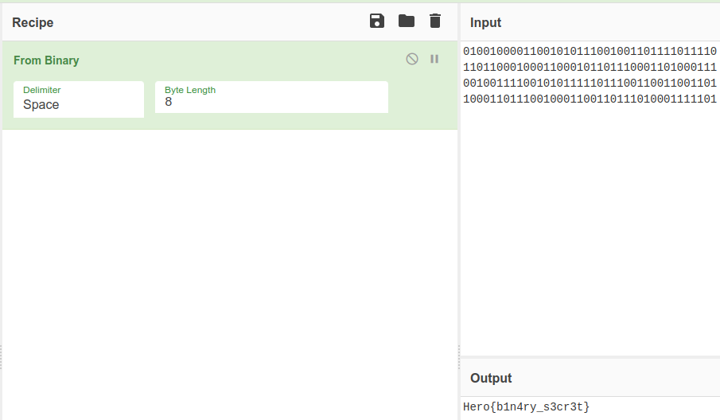

# Annoucement

### Category

Steganography

### Description

A member of the staff is trying to send a message to an accomplice. He used a communication channel that every HeroCTF staff member has access to. Therefore, he had to hide it in plain sight. Can you find it?

Format : **Hero{flag}**<br>
Author : **Log_s**

### Write up

When the HeroCTF made it's annoucement, it was done using a nice animated GIF. It was published on twitter and linkdin.

[https://twitter.com/HeroCTF](https://twitter.com/HeroCTF/status/1650061617260797952)

If you look carefully at the animation on both sides, you could notice that a column of bits are a little bit clearer.


Buy playing the video for a few seconds, you will notice another clearer column of bits. They are the same : it's a loop.

There are 4 differents lines, that reapeat them selfs.

Let's copy the unique part, both horitontally and vertically.

You might have to change the order depending on the line you started with. 

```
01001000011001010111001001101111011110
11011000100011000101101110001101000111
00100111100101011111011100110011001101
10001101110010001100110111010001111101
```

Let's put this is [cyberchef](https://cyberchef.io/#recipe=From_Binary\('Space',8\)&input=MDEwMDEwMDAwMTEwMDEwMTAxMTEwMDEwMDExMDExMTEwMTExMTAKMTEwMTEwMDAxMDAwMTEwMDAxMDExMDExMTAwMDExMDEwMDAxMTEKMDAxMDAxMTExMDAxMDEwMTExMTEwMTExMDAxMTAwMTEwMDExMDEKMTAwMDExMDExMTAwMTAwMDExMDAxMTAxMTEwMTAwMDExMTExMDE) and decode it.



### Flag

```Hero{b1n4ry_s3cr3t}```
