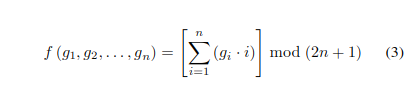

# EMD

### Category 

Steganography

### Description

Our agents discovered that a group of Breton extremists were communicating with each other through postcards representing the landscape of the region. We have managed to intercept an image and we are convinced that it contains information that is crucial to dismantling this group.
Some information to help you: 
- The size of the pixel groups is 2
- The size of the hidden message is 841 characters
- The image must be divided into groups containing 2 pixels that follow each other on the x-axis.
- No secret key has been used during the encryption, so there is no random permutation of the pixels
Good luck!

This challenge uses the most basic "Exploiting Modification Direction" technique described by Xinpeng Zhang and Shuozhong Wang in their paper "Efficient Steganographic Embedding by Exploiting Modification Direction"

Format : **Hero[]** WARNING : For this challenge, square brackets [] are used and not braces {}.<br>
Author : **Thibz**

### Files

[Vannes](vannesHidden.png)

### Write up

#### Understand how to hide a message

To succeed in this challenge, you must first understand what the EMD technique is. The description of the challenge gives us a research paper name with its two authors. To understand how to find this message, we must first see how it was hidden. So we try to get information about this paper and we find a clear explanation : 

```
How to hide a message : 

The main idea of the proposed steganographic method is that each secret digit in a (2n +1)-ary notational system is carried by n cover pixels, where n is a system parameter,and, at most, only one pixel is increased or decreased by 1. Actually, for each group of n pixels, there are 2n possibleways of modification. The 2n different ways of alteration plus the case in which no pixel is changed form (2n +1) different values of a secret digit.
```

To translate this into clearer language, this method allows to hide a number in base (2n+1) in a group of n pixels. 

For example, in our challenge, the description tells us that the image is divided into groups of two pixels. This means that in each group of 2 pixels, there is a digit in base (2*2+1) = 5 hidden. To hide this digit, we must add or subtract 1 to the value of one of the two pixels, which gives us 5 possibilities:

- Add 1 to the first pixel
- Subtract 1 from the first pixel
- Add 1 to the second pixel
- Subtract 1 from the second pixel
- Do not touch anything

The pixels are in black and white so their value varies between 0 and 255.

This is perfect: we have a base 5 number to hide (0 or 1 or 2 or 3 or 4) and 5 possible combinations. Unfortunately, in everyday life, we do not operate in base 5. So we have to convert a message into a list of numbers in base 5.

Let's take the example of the "Hello World!" message : we convert each character to int with its unicode code : 

`
72 101 108 108 111 32 87 111 114 108 100 33
`

Then we convert each number to base 5 : 

`
242 401 413 413 421 112 322 421 424 413 400 113
`

So we would need 36 groups of 2 pixels to hide the message "Hello World!". But how do I know which pixel to add or subtract 1 to? The white paper give us information about that.

```
Denote the gray values of pixels in a group as g1,g2,...,gn and calculate the extraction function f as a weighted sum modulo (2n +1) :
```




```
Where w1,w2,...,wn are the weights of pixels in the group. The weights are chosen to satisfy the following conditions:


Map each secret digit in the (2n +1)-ary notational system to a pixel-group. No modification is needed if a secret digit d equals the extraction function of the original pixel-group. When d != f, calculate s = d − f mod (2n +1). If s is no more than n, increase the value of g(s) by 1, otherwise,decrease the value of g(2n+1−s) by 1.
```

This may seem a bit complicated at first but let's recap: 

For each group of n pixels, we will use a function f taking as parameters the values g1 up to gn corresponding to the int value of the n pixels of the group. This function will sum the values of the pixels multiplied by their index modulo 2n+1.

Let's imagine a group of two pixels having as respective values 98 and 240. The extraction function f will give: 
```
f(98,240) = (98*1)+(240*2) % 5 
f(98,240) = 578 % 5
f(98,240) = 3
```

What the text tells us is that if the f-value is equal to the digit "d" to be hidden then we do nothing. On the other hand, when d != f then we calculate the difference between d and f.

```
s = d-f
```

If s is not less than n, then we increase by 1 the value of the pixel contained in index s in the group. And if not, we decrease by 1 the value of the pixel at index 2n+1-s.

It's really not complicated, just apply this method for all the digits to hide and it's perfect.

#### Understand how to find the message

Now that we know how to hide a message, it is much easier to understand how to find it: just do the reverse process. The white paper tells us : 

 ```
 On the receiving side, the secret digit canbe easily extracted by calculating the extraction function ofstego-pixel-group. 
 ```

We know that in our challenge, the groups are composed of two pixels: we separate our image in groups of two pixels and we make a loop on the size of the message. There is however a difficulty, the extracted message will be in base 5, it is necessary to know that the ASCII characters are represented by 3 digits in base 5. 

For each group of pixels, we calculate the extraction function f that we saw above. We thus obtain a list of digits in base 5. We divide this list in groups of 3 digits which represent each one a character that we convert.

```python
def retrieveDataWithEMD(image, n, sizeFlag):
    # Check if the image is in greyscale
    if image.mode != 'L':
        print("[-] Image is not in greyscale")
        return

    modulo = 2*n+1
    print("[-] Modulo = " + str(modulo))

    # Compute width and height of the image
    width, height = image.size
    print("[-] Image size: " + str(width) + "x" + str(height))
    
    secret = []
    pixels = list(image.getdata())
    usableSize = int((len(pixels)) - (len(pixels) % n))
    print("[-] Usable size = " + str(usableSize))

    numberOfGroupFor1Char = len(decimalToBaseArray(ord('a'),modulo))
    print("[-] Number of pixels groups required to hide 1 char : " + str(numberOfGroupFor1Char))

    for i in range(0,usableSize,n):

        if len(secret) >= sizeFlag * numberOfGroupFor1Char:
                break

        # We compute the value of f
        pixelList = pixels[i:i+n]
        d = computeF(pixelList,modulo,n)
        secret.append(d)

        secretChars = []

        for i in range(0,len(secret),numberOfGroupFor1Char):
            secretChars.append(chr(baseToDecimalArray(secret[i:i+numberOfGroupFor1Char],modulo)))

        s = ''.join(str(x) for x in secretChars)

    print("[-] Secret message: " + s)
```

### Flag

```Hero[V4NN3S_C17Y_F7W]```