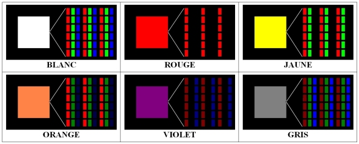
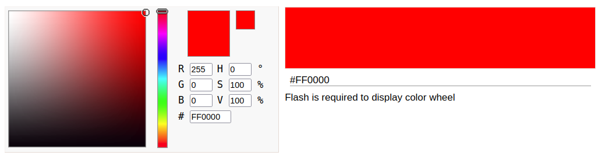
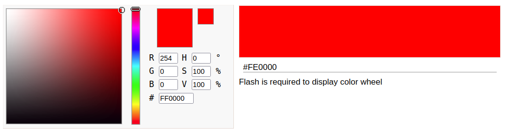
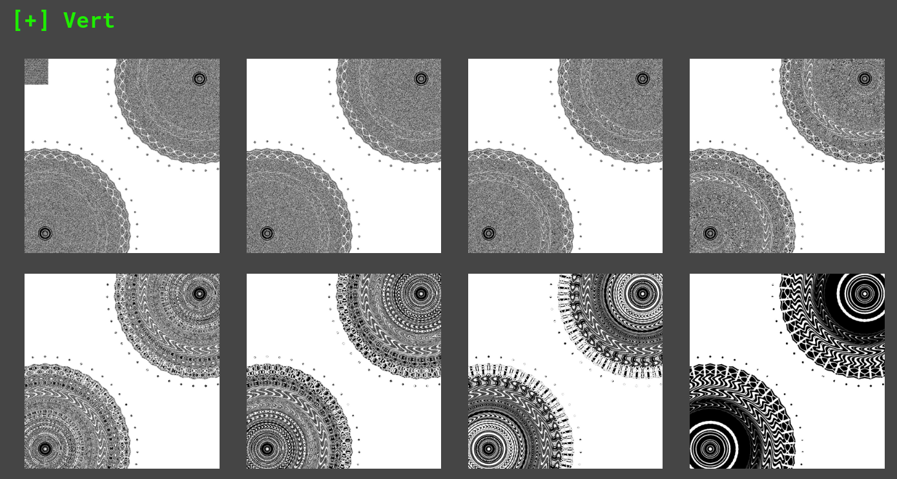

# LSD#2

### Category 

Steganography

### Description

Don't try to throw random tools at this poor image. Go back to the basics and learn the detection techniques.

A little hint to make your life easier : 200x200<br>

Good luck!<br>

Format : **Hero{}**<br> 
Author : **Thibz**

### Files

[secret.png](secret.png)

### Write up

In order to solve this challenge, it is enough to look at the title to give us an interesting lead: the LSD (Least-Significant Bit).
The description tells us that it is useless to launch automatic scripts and that we have to think about it, too bad.

There is a fairly simple way to detect traces of LSB in an image. 

Some basics before going further. A colour image is made up of pixels. Each pixel is composed of three RGB layers for Red Green Blue. 
In computing, each of the three layers is a value between 0 and 255. 



Thus, to have a red pixel, the pixel must have the value (255,0,0) which could be translated as 100% red, 0% green and 0% blue. Yellow is a mixture of red and green. A yellow pixel will therefore have a value of (255,255,0) which is translated as : 100% red, 100% green and 0% blue.

We also know that in computing, everything is binary. So a red pixel is coded like this: 

```
R : (11111111)
G : (00000000)
B : (00000000)
```

What happens if we set the Least Significant Bit to 0 on the Red layer? 

Color with red value at 255 :


Color with red value at 254 :


The two colours are different but to the naked eye the two colours look identical. This is the principle on which the technique is based, we will hide our message in the least significant bits of an image. 

Now that we know how it works, let's look at how we can detect it. The aim is to make this normally invisible change much more visible to the naked eye. Filters exist to do exactly what we want. These filters will display the image according to the value of each of the 8 bits of each layer. 

I use [AperiSolve](https://www.aperisolve.com/) which allows me to display the image according to the 16 filters displayed.

The 8 filters on the green layer : 



Each of these images will keep one of the 8 bits of the green layer while setting all others to 0. 

The top left image will keep only the least significant bit and set everything else to 0. We realise that a square appears, just as if the least significant bits were not all the same on the green layer... 

We just need to iterate over this 200*200 square and recover all the least significant bits of the green layer.

```python
def stringToFile(string, dst):
    file = open(dst, 'w')
    file.write(string)
    file.close()

def binaryToString(binary):
    return ''.join([chr(int(binary[i:i+8], 2)) for i in range(0, len(binary), 8)])

def decode(src):
    print("[-] Decoding... ")
    
    extracted_bin = ""
    img = Image.open(src, 'r')

    width, height = img.size
    print("[-] Image size: {}x{}".format(width, height))
    for x in range(0, 200):
        for y in range(0, 200):
            pixel = list(img.getpixel((x, y)))
            # Pixel[1] is the green plane
            extracted_bin = extracted_bin + str((pixel[1] & 1))
    
    stringToFile(binaryToString(extracted_bin), "extracted.txt")
    print("[-] Message extracted !")
    print("[-] Message saved as extracted.txt")

```

### Flag

```Hero{0NL1NE_700L_0V3RR473D}```