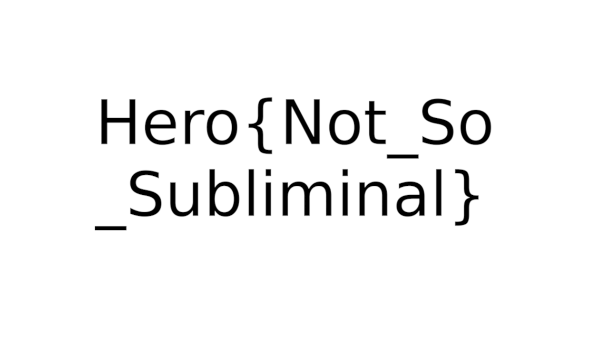

# Subliminal#2

### Category 

Steganography

### Description

An image has been hidden in this video. Don't fall into madness.

Little squares size : 20x20 pixels

Format : **Hero{}**<br>
Author : **Thibz**

### Files

[Triangle](subliminal_hide.mp4)

### Write up

To really understand what is going on in this video, we have to watch it entirely. Around the middle of the video, we can see some squares with text part on it. 

The video is divided into frames and each frame contains a 20x20 pixels part of the flag image. To retrieve the flag, we have to invert the process. 

```python
def retrieve_image(video_path, output_path):
    video = cv2.VideoCapture(video_path)
    width = int(video.get(3))
    height = int(video.get(4))

    # Black image at the beginning
    image = np.zeros((height, width, 3), np.uint8)

    i = 0
    while True:
        # Read a video frame
        ret, frame = video.read()
        if not ret:
            break

        # Get the square and add it to the flag file
        x = i % (width // 20) * 20
        y = i // (width // 20) * 20
        image[y:y+20, x:x+20] = frame[y:y+20, x:x+20]
        i += 1
    
    cv2.imwrite(output_path, image)
    video.release()
```



### Flag

```Hero{Not_So_Subliminal}```